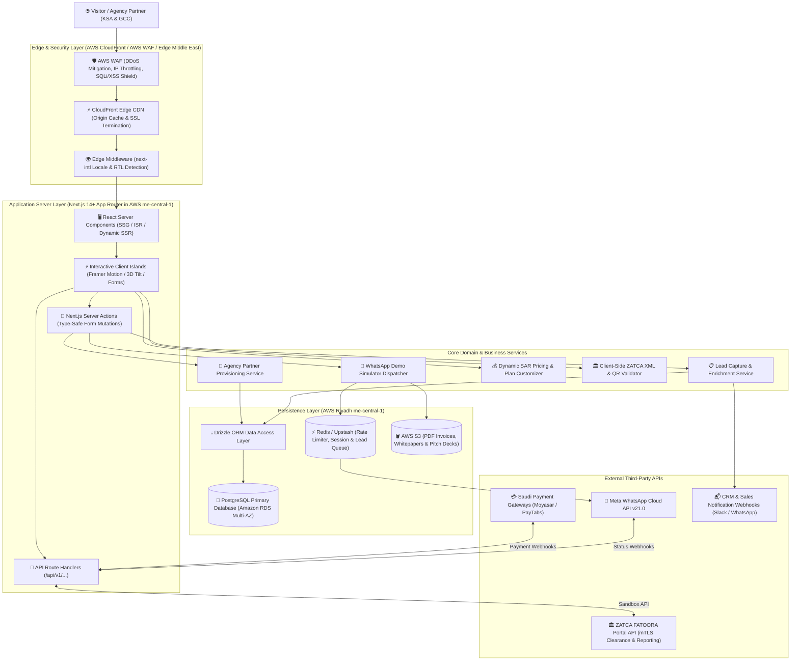
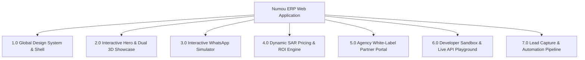
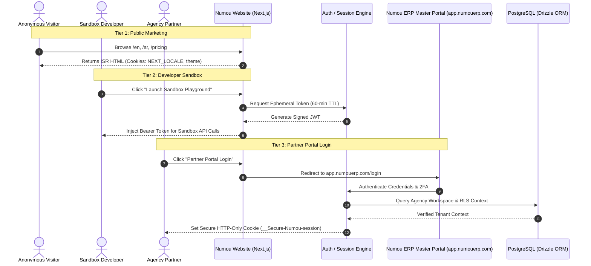
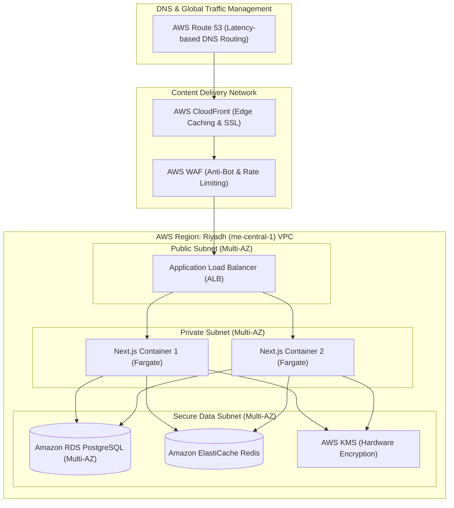
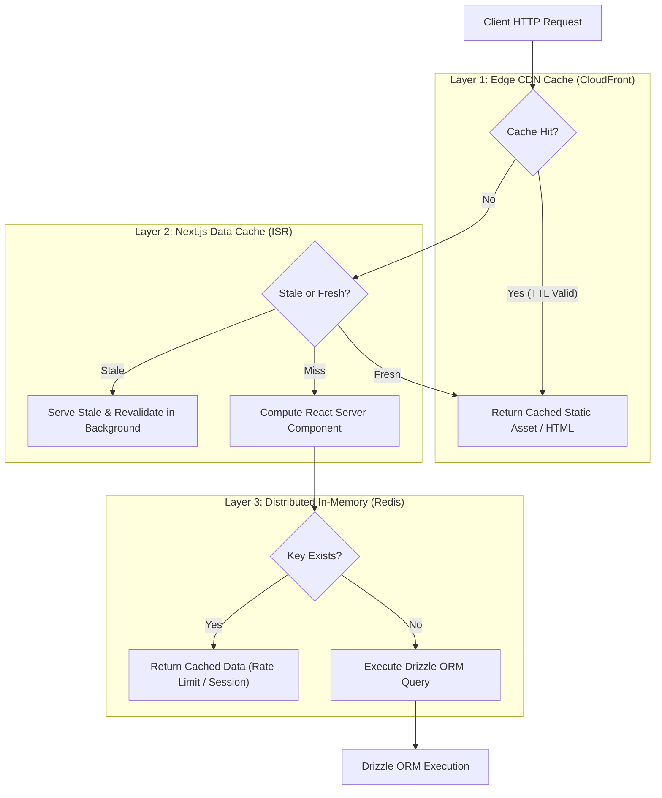

?# Website & Frontend Architecture Document — Numou ERP

**Company:** Numou Technologies Limited  
**Product:** Numou ERP  
**Tagline:** Empowering Smart Business Growth. (Arabic: تمكين نمو الأعمال الذكية.)  
**Target Environment:** AWS Riyadh (`me-central-1`) & Global Edge CDN  
**Framework:** Next.js 14+ (App Router) with TypeScript & React 19  
**Database & ORM:** PostgreSQL + Drizzle ORM  
**Location:** `Website/architecture.md`  
**Version:** 3.0 (Comprehensive Senior System Analyst Architecture)  

---

## 1. High Level Architecture

The Numou ERP website serves as the public digital flagship, high-converting sales engine, interactive compliance simulator, and white-label agency onboarding gateway for Numou Technologies Limited across the Kingdom of Saudi Arabia and the GCC region.



---

## 2. Low Level Architecture

### 2.1 Component Architecture & Hydration Boundary
The user interface implements a strict **Server-Component-First** pattern. Static content is rendered ahead of time on the server; dynamic interactivity is scoped strictly to lightweight, lazy-hydrated client islands:

```
[Page Shell: Server Component] (Zero Client JS)
  │
  ├── [Navbar: Server Component]
  │     └── [LanguageSwitcher: Client Component] (Locale cookie mutation)
  │     └── [ThemeToggle: Client Component] (NextThemes provider)
  │
  ├── [HeroSection: Server Component]
  │     ├── [Static Typography & Badges] (Pre-rendered HTML)
  │     └── [InteractiveShowcaseIsland: Client Component] (Framer Motion 3D tilt & SVG charts)
  │
  ├── [TrustMarquee: Client Component] (CSS infinite hardware-accelerated transform)
  │
  ├── [ProblemSolutionMatrix: Server Component] (Static semantic comparison table)
  │
  ├── [InteractivePricingIsland: Client Component] (Zustand state for SAR slider calculations)
  │
  └── [WhatsAppDemoWidget: Client Component] (React Hook Form + Zod + Server Action)
```

### 2.2 Internationalization & RTL Pipeline (`next-intl`)
* **Locale Routing:** Prefixed routes `/[locale]/...` supporting `en` (English, LTR) and `ar` (Arabic, RTL).
* **Automated Geolocation Negotiation:** Edge middleware inspects `Accept-Language` header, CloudFront country code (`CloudFront-Viewer-Country: SA`), and fallback cookie `NEXT_LOCALE`.
* **RTL DOM Mirroring:** Injected `dir="rtl"` attribute at `<html lang="ar" dir="rtl">` root layout with Tailwind CSS `rtl:` modifier support.
* **Dual Typography Hierarchy:**
  - English: `Plus Jakarta Sans` via `next/font/google` (modern geometric).
  - Arabic: `IBM Plex Sans Arabic` via `next/font/google` (clean corporate legibility).

### 2.3 Client State Management Strategy
* **Local UI State:** React `useState` for toggles, accordions, and modal visibility.
* **Pricing & Configuration State:** Lightweight `zustand` store (`usePricingStore`) managing:
  - Active Track: `'BUSINESS' | 'AGENCY'`
  - Billing Cycle: `'MONTHLY' | 'ANNUAL'` (applies 20% discount)
  - Invoice Volume Slider: `500` to `100,000+`
  - Sub-account count for agencies: `1` to `100+`
* **Form & Mutation State:** `react-hook-form` paired with `@hookform/resolvers/zod` for zero-flash validation errors.

---

## 3. Module Breakdown



### Module 1.0: Global Design System & Shell
* **Color Tokens:** Saudi Royal Emerald (`#064E3B`), Emerald Glow (`#059669`), Desert Gold (`#D4AF37`), Deep Slate Ink (`#0F172A`).
* **Components:** Navigation header with language switcher, theme toggle (NextThemes), mobile drawer, and high-conversion sticky footer.
* **Accessibility:** WCAG 2.1 AA compliant, Radix UI accessible primitives.

### Module 2.0: Interactive Hero & Dual 3D Showcase (AmalERP Benchmark)
* **Left Window (`<DashboardMockup />`):** Simulates live `app.numouerp.com` dashboard with animated SVG revenue sparklines, business health score donut dial, and real-time ZATCA green clearance stamp badge (`CLEARED #388`).
* **Right Window (`<PhoneMockup />`):** Realistic iPhone 15 frame simulating WhatsApp chat with verified green badge (`Numou Invoicing Bot`) rendering dynamic interactive PDF message cards and click-to-pay Mada buttons.
* **Physics:** Framer Motion 3D perspective tilt (`perspective: 1600px`, `rotateX`, `rotateY`) reacting to user cursor movement.

### Module 3.0: Instant WhatsApp Invoicing Simulator
* **Functionality:** Visitors enter their phone number (+966...) into an interactive widget.
* **Execution:** A Next.js Server Action invokes the Meta WhatsApp Cloud API via `IWhatsAppService`, instantly pushing an actual sample bilingual ZATCA Phase 2 compliant PDF to the visitor's WhatsApp within 10 seconds.

### Module 4.0: Dynamic SAR Pricing & Plan Customizer
* **Dual Track Switcher:** Toggle between **[ Business Packages ]** and **[ Agency / Reseller Packages ]**.
* **Interactive Plan Customizer:** Sliders for invoice volume, user seats, and branches with real-time recalculation of monthly and annual savings (20% annual discount).

### Module 5.0: Agency White-Label Partner Portal (`/partner-program`)
* **ROI Calculator Widget:** Sliders for active clients and retail subscription pricing displaying net annual agency profit (ARR).
* **Interactive Rebranding Demo:** Interactive toggle demonstrating how generic portal branding transforms into a customized agency domain (`billing.youragency.sa`) with custom logos and colors.
* **Partner Application Flow:** Validated form capturing company credentials, CRN, and target client volume.

### Module 6.0: Developer Sandbox & API Reference
* **Live Sandbox:** Allows developers to input sample invoice JSON payloads and see canonicalized UBL 2.1 XML, SHA-256 hash, and Base64 TLV QR codes rendered in real time.
* **SDK Quickstarts:** Code copy blocks for Node.js, TypeScript, PHP/Laravel, Python, and cURL.

### Module 7.0: Lead Capture & Sales CRM Pipeline
* **Form Handlers:** Contact sales, schedule 1-on-1 demo, download agency pitch deck.
* **Automations:** Real-time Slack/WhatsApp webhook alert to Numou sales team in Riyadh; automated confirmation email with PDF attachment.

---

## 4. Comprehensive Folder Structure

```
Website/
├── public/
│   ├── assets/
│   │   ├── branding/           # Numou ERP logos (SVG, PNG, favicon)
│   │   ├── mockups/            # Dashboard & phone mockup graphic assets
│   │   ├── badges/             # ZATCA, AWS Riyadh, Mada, Vision 2030 badges
│   │   └── og.png              # 1200x630 Open Graph sharing card
├── src/
│   ├── app/
│   │   ├── [locale]/           # Bilingual App Router Root (en / ar)
│   │   │   ├── layout.tsx      # Root Layout with Font injection & dir="ltr|rtl"
│   │   │   ├── page.tsx        # High-Converting Homepage
│   │   │   ├── solutions/
│   │   │   │   ├── service-businesses/page.tsx
│   │   │   │   ├── it-agencies/page.tsx
│   │   │   │   └── pos-vendors/page.tsx
│   │   │   ├── features/
│   │   │   │   ├── zatca-engine/page.tsx
│   │   │   │   ├── whatsapp-invoicing/page.tsx
│   │   │   │   └── ai-copilot/page.tsx
│   │   │   ├── partner-program/page.tsx # Dedicated Agency Partner Page
│   │   │   ├── pricing/page.tsx         # Interactive SAR Pricing Page
│   │   │   ├── docs/page.tsx            # Developer API Documentation
│   │   │   └── contact/page.tsx         # Sales & WhatsApp Contact
│   │   ├── api/
│   │   │   ├── health/route.ts          # Health Check & Uptime Route
│   │   │   └── v1/
│   │   │       ├── demo-simulator/route.ts  # WhatsApp Instant Demo Route
│   │   │       ├── leads/route.ts           # Inbound Lead Webhook Route
│   │   │       ├── partner-apply/route.ts   # Partner Application Route
│   │   │       └── sandbox/
│   │   │           └── validate-invoice/route.ts # Live Sandbox Validator
│   ├── components/
│   │   ├── ui/                 # Accessible primitives (Button, Card, Dialog, Input, Slider)
│   │   ├── layout/             # Navbar, Footer, MobileNav, LanguageToggle, ThemeToggle
│   │   ├── home/               # HeroSection, TrustMarquee, ProblemMatrix, FeatureGrid
│   │   ├── mockups/            # DashboardMockup, PhoneMockup, LiveChatPreview
│   │   ├── pricing/            # PricingToggle, TierCard, VolumeSlider, RoiCalculator
│   │   └── partner/            # WhitelabelSwitcher, PartnerRoiWidget, ApplyModal
│   ├── lib/
│   │   ├── db/                 # Drizzle ORM Data Layer
│   │   │   ├── schema.ts       # Drizzle Tables (Leads, Partners, Invoices)
│   │   │   └── index.ts        # PostgreSQL connection pool with Drizzle client
│   │   ├── actions/            # Next.js Server Actions (leadCapture, sendDemo, applyPartner)
│   │   ├── zatca/              # Client-side TLV QR generator & validator
│   │   ├── whatsapp/           # Meta Cloud API payload builders
│   │   ├── rateLimiter.ts      # Redis Sliding Window Rate Limiter
│   │   └── utils.ts            # Tailwind class merger (cn), formatting, SAR currency
│   ├── messages/               # Internationalization Dictionaries
│   │   ├── en.json             # English UI strings
│   │   └── ar.json             # Arabic UI strings
│   ├── styles/
│   │   └── globals.css         # Tailwind base, aurora mesh animations, glassmorphism
│   └── middleware.ts           # Next-Intl Edge Middleware (Locale Negotiation)
├── drizzle.config.ts           # Drizzle Kit Configuration
├── next.config.mjs             # Next.js Configuration with next-intl plugin
├── tailwind.config.ts          # Tailwind Theme (Emerald, Gold, Slate tokens)
└── tsconfig.json               # Strict TypeScript configuration
```

---

## 5. API Boundary & Server Actions

All public mutations use **Next.js Server Actions** with strict Zod validation, ensuring type safety and zero client bundle pollution:

### 5.1 Route Handlers Specification Table
| Route | Method | Purpose | Input Payload | Rate Limit |
| :--- | :---: | :--- | :--- | :---: |
| `/api/health` | `GET` | Uptime & edge health check | None | None |
| `/api/v1/demo-simulator` | `POST` | Trigger instant sample WhatsApp invoice | `{ phone: string, lang: 'ar' \| 'en' }` | 3 req/hr/IP |
| `/api/v1/leads` | `POST` | General sales & demo inquiry | `{ name, email, phone, company, type }` | 5 req/min/IP |
| `/api/v1/partner-apply` | `POST` | Agency partner registration | Partner Application Zod Schema | 3 req/hr/IP |
| `/api/v1/sandbox/validate-invoice` | `POST` | Validate JSON invoice & return XML/QR | Invoice Request Payload | 30 req/min/IP |

### 5.2 Server Action Implementation Example
```typescript
// src/lib/actions/partnerActions.ts
'use server';

import { z } from 'zod';
import { db } from '@/lib/db';
import { leads } from '@/lib/db/schema';
import { rateLimiter } from '@/lib/rateLimiter';

const PartnerSchema = z.object({
  fullName: z.string().min(2, 'Name is required'),
  agencyName: z.string().min(2, 'Agency name is required'),
  email: z.string().email('Valid business email required'),
  phone: z.string().regex(/^\+966[5][0-9]{8}$/, 'Valid Saudi mobile (+9665XXXXXXXX) required'),
  clientCount: z.enum(['LESS_THAN_10', '10_TO_30', '30_TO_100', '100_PLUS']),
  techStack: z.string().optional(),
});

export async function applyForPartnerProgram(rawData: unknown) {
  // 1. Sliding window rate limit check (Upstash Redis)
  const isAllowed = await rateLimiter.check('partner-apply');
  if (!isAllowed) {
    return { success: false, error: 'RATE_LIMIT_EXCEEDED' };
  }

  // 2. Strict Zod Schema Validation
  const validated = PartnerSchema.safeParse(rawData);
  if (!validated.success) {
    return { success: false, errors: validated.error.flatten().fieldErrors };
  }

  // 3. Database persistence via Drizzle ORM
  await db.insert(leads).values({
    name: validated.data.fullName,
    company: validated.data.agencyName,
    email: validated.data.email,
    phone: validated.data.phone,
    type: 'AGENCY_PARTNER',
    metadata: {
      clientCount: validated.data.clientCount,
      techStack: validated.data.techStack,
    },
    createdAt: new Date(),
  });

  // 4. Trigger automated welcome email with Pitch Deck PDF
  return { success: true };
}
```

---

## 6. Authentication & Session Flow

The website architecture provides three cleanly segregated authentication tiers:



1. **Tier 1 (Public Visitors):** Zero authentication overhead. Stateful UI preferences (selected locale, dark/light theme, collapsed states) persist in lightweight client cookies (`NEXT_LOCALE`, `theme`).
2. **Tier 2 (Developer Sandbox):** Generates short-lived, signed, stateless JWTs (60-minute TTL) allowing developers to test mock ZATCA clearance and QR decoding endpoints without registration.
3. **Tier 3 (Partner & Enterprise Dashboard):** Seamless SSO redirect to `app.numouerp.com/login` using secure HTTP-only cookies, AES-256 encrypted JWTs, and PostgreSQL Row-Level Security (RLS) managed by Drizzle ORM.

---

## 7. Deployment Architecture



* **Data Residency Compliance:** In strict accordance with the Saudi Cloud Computing Regulatory Framework (CCRF) and National Cybersecurity Authority (NCA) guidelines, all application compute, databases, and logs reside in **AWS Riyadh (`me-central-1`)**.
* **Edge CDN Nodes:** CloudFront edge locations in Riyadh, Jeddah, Dammam, Dubai, and Bahrain deliver sub-30ms latency across the GCC.
* **Storage Archival:** Long-term PDF invoices and compliance pitch decks are stored in an encrypted AWS S3 bucket with versioning and immutable object locking (WORM) enabled.

---

## 8. Scalability Plan

To sustain unexpected traffic spikes during nationwide ZATCA wave enforcement deadlines:

1. **Stateless Compute Autoscaling:**
   - Next.js application runs inside containerized AWS ECS (Fargate) tasks.
   - Autoscaling policies scale tasks out based on Target Tracking:
     - CPU utilization threshold: `> 70%`
     - Request count per target: `> 1,500 req/min`
2. **Database Scalability (Drizzle ORM + RDS Proxy):**
   - Implements AWS RDS Proxy / PgBouncer to pool database connections, preventing connection saturation during concurrency spikes.
   - Read replicas for heavy analytics queries (e.g., historical transaction aggregation).
3. **Core Web Vitals Optimization Plan:**
   - **Lighthouse Target:** `95+` on Mobile and Desktop.
   - **First Contentful Paint (FCP):** `< 0.9s` via Edge streaming and critical CSS inline delivery.
   - **Largest Contentful Paint (LCP):** `< 1.2s` using WebP/AVIF responsive images (`next/image`) with preloaded LCP hero elements.
   - **Cumulative Layout Shift (CLS):** `0.00` via reserved container dimensions and font display swap properties.

---

## 9. Caching Strategy



* **Static Assets:** Static files (`/public/assets/*`, fonts, CSS, JS chunks) carry immutable cache headers: `Cache-Control: public, max-age=31536000, immutable`.
* **ISR Marketing Pages:**
  - Homepage (`/`): Revalidated every `3,600s` (1 hour).
  - Pricing Page (`/pricing`): Revalidated every `300s` (5 minutes) with tag-based on-demand revalidation:
    ```typescript
    import { revalidateTag } from 'next/cache';
    export async function updatePricing() {
      revalidateTag('pricing-plans');
    }
    ```
* **Dynamic Mutation Rate Limiter:** Upstash Redis sliding window counter (max 5 submissions per minute per IP for lead forms).

---

## 10. Logging Strategy & Observability

### 10.1 Structured Logging Standards
All application logs are formatted as structured JSON to enable instant parsing in AWS CloudWatch and Datadog:

```json
{
  "timestamp": "2026-09-19T20:30:00.123Z",
  "level": "INFO",
  "environment": "production",
  "service": "Numou-website",
  "traceId": "trace-9842a-871b",
  "event": "PARTNER_APPLICATION_SUBMITTED",
  "clientIp": "158.140.x.x",
  "metadata": {
    "company": "Saudi Software Solutions Ltd",
    "clientTier": "30_TO_100",
    "durationMs": 42
  }
}
```

### 10.2 Privacy & PII Masking (Saudi PDPL Compliance)
Under the **Saudi Personal Data Protection Law (PDPL)**, all personally identifiable information (PII) is masked before logging:
* Saudi Mobile Numbers: `+96650****123`
* Tax Identification Numbers (VAT): `310122*****0003`
* Passwords & API Secrets: Completely stripped at the middleware layer.

### 10.3 Distributed Tracing & Error Monitoring
* **Sentry Next.js SDK:** Captures uncaught client/server runtime exceptions, hydration errors, and API 500s with full stack traces and sourcemaps.
* **OpenTelemetry / AWS X-Ray:** Traces request lifecycles from Edge CDN through Next.js Server Components to Drizzle database queries.
* **Business Funnel Analytics:** PostHog tracking conversion funnels:
  `Hero View` ➔ `WhatsApp Simulator Try` ➔ `Pricing Customizer Touch` ➔ `Trial Registration / Partner Application`.

