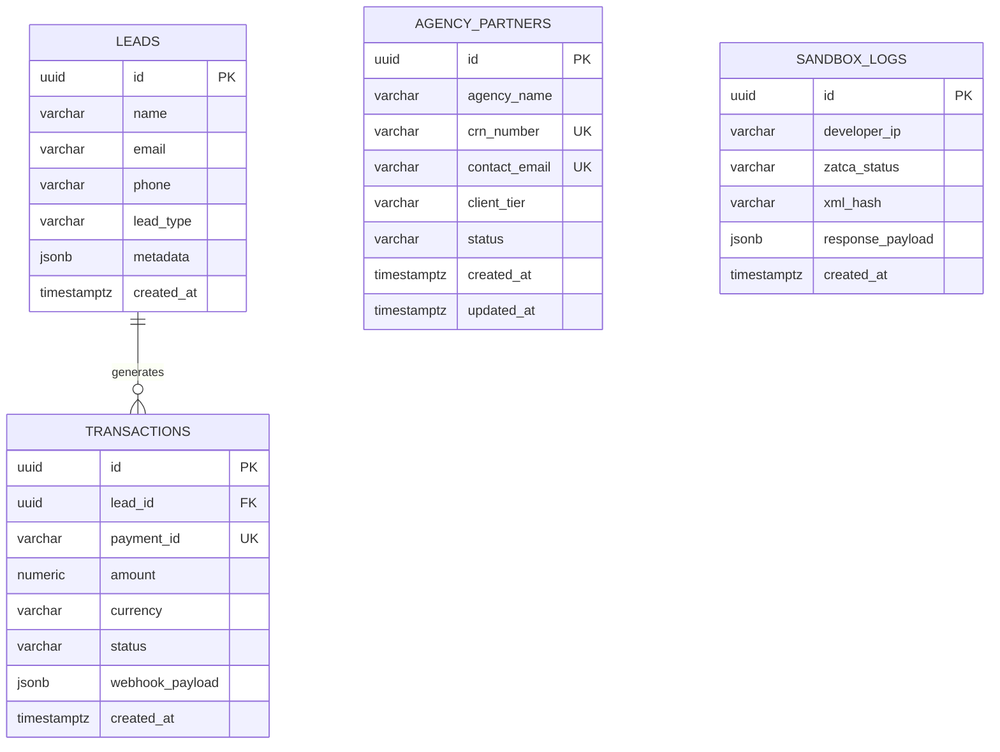

?# Database Documentation — Numou ERP Website & Portal

**Location:** `Website/database.md`  
**Database Engine:** PostgreSQL (Amazon RDS)  
**ORM:** Drizzle ORM (Note: Replaces Mongoose as per project architecture)

---

## 1. Table / Collection List

The website frontend and marketing portal relies on the following primary tables (collections):

1. **`leads`**: Stores inbound inquiries, contact form submissions, and demo requests.
2. **`agency_partners`**: Stores white-label agency partner applications and their profiles.
3. **`sandbox_logs`**: Stores ZATCA developer sandbox test payloads and validation results.
4. **`transactions`**: Stores payment logs and click-to-pay transaction webhooks.

---

## 2. Schema Definition (PostgreSQL)

```sql
CREATE TABLE leads (
  id UUID PRIMARY KEY DEFAULT gen_random_uuid(),
  name VARCHAR(255) NOT NULL,
  email VARCHAR(255) NOT NULL,
  phone VARCHAR(20) NOT NULL,
  lead_type VARCHAR(50) NOT NULL, -- e.g., 'DEMO', 'TRIAL', 'AGENCY'
  metadata JSONB,
  created_at TIMESTAMPTZ NOT NULL DEFAULT NOW()
);

CREATE TABLE agency_partners (
  id UUID PRIMARY KEY DEFAULT gen_random_uuid(),
  agency_name VARCHAR(255) NOT NULL,
  crn_number VARCHAR(10) NOT NULL UNIQUE,
  contact_email VARCHAR(255) NOT NULL UNIQUE,
  client_tier VARCHAR(50) NOT NULL,
  status VARCHAR(50) NOT NULL DEFAULT 'PENDING_REVIEW',
  created_at TIMESTAMPTZ NOT NULL DEFAULT NOW(),
  updated_at TIMESTAMPTZ NOT NULL DEFAULT NOW()
);

CREATE TABLE sandbox_logs (
  id UUID PRIMARY KEY DEFAULT gen_random_uuid(),
  developer_ip VARCHAR(45),
  zatca_status VARCHAR(50) NOT NULL, -- 'PASSED', 'WARNING', 'FAILED'
  xml_hash VARCHAR(64),
  response_payload JSONB,
  created_at TIMESTAMPTZ NOT NULL DEFAULT NOW()
);

CREATE TABLE transactions (
  id UUID PRIMARY KEY DEFAULT gen_random_uuid(),
  lead_id UUID REFERENCES leads(id) ON DELETE SET NULL,
  payment_id VARCHAR(255) NOT NULL UNIQUE,
  amount NUMERIC(10, 2) NOT NULL,
  currency VARCHAR(3) NOT NULL DEFAULT 'SAR',
  status VARCHAR(50) NOT NULL, -- 'PENDING', 'PAID', 'FAILED'
  webhook_payload JSONB,
  created_at TIMESTAMPTZ NOT NULL DEFAULT NOW()
);
```

---

## 3. Relationship

*   **`leads` to `transactions`**: One-to-Many (1:N). A lead can have multiple payment attempts or transactions.
*   **`agency_partners`**: Currently standalone in the marketing DB, but maps to a multi-tenant workspace in the core ERP database upon approval.

---

## 4. Index

To ensure high performance for queries and webhook lookups:

*   **`agency_partners`**:
    *   `CREATE UNIQUE INDEX idx_agency_crn ON agency_partners(crn_number);`
    *   `CREATE UNIQUE INDEX idx_agency_email ON agency_partners(contact_email);`
*   **`transactions`**:
    *   `CREATE UNIQUE INDEX idx_transactions_payment_id ON transactions(payment_id);`
    *   `CREATE INDEX idx_transactions_lead_id ON transactions(lead_id);`
*   **`leads`**:
    *   `CREATE INDEX idx_leads_type_created ON leads(lead_type, created_at DESC);`

---

## 5. Validation

Validation is handled at the application layer using **Zod** before reaching Drizzle ORM:

```typescript
import { z } from 'zod';

export const LeadSchema = z.object({
  name: z.string().min(2).max(255),
  email: z.string().email(),
  phone: z.string().regex(/^\+9665[0-9]{8}$/, 'Must be a valid Saudi mobile number'),
  lead_type: z.enum(['GENERAL_INQUIRY', 'DEMO_REQUEST', 'TRIAL_SIGNUP', 'AGENCY_PARTNER']),
});
```

---

## 6. Aggregation

Example aggregation for the Admin Dashboard to count lead conversions and partner applications by month:

```sql
SELECT 
  date_trunc('month', created_at) as month,
  lead_type,
  COUNT(*) as total_leads
FROM leads
GROUP BY 1, 2
ORDER BY month DESC;
```

---

## 7. Transaction

Database transactions are required when an Agency Partner applies and pays a setup fee simultaneously:

```typescript
await db.transaction(async (tx) => {
  // 1. Create Lead
  const [newLead] = await tx.insert(leads).values({...}).returning();
  
  // 2. Create Pending Transaction Record
  await tx.insert(transactions).values({
    lead_id: newLead.id,
    payment_id: generatePaymentId(),
    amount: '899.00',
    status: 'PENDING'
  });
});
```

---

## 8. Sample Data

**`agency_partners`**
```json
{
  "id": "a1b2c3d4-e5f6-7890-1234-56789abcdef0",
  "agency_name": "Riyadh Tech Solutions",
  "crn_number": "1010123456",
  "contact_email": "hello@riyadhtech.sa",
  "client_tier": "30_TO_100",
  "status": "APPROVED",
  "created_at": "2026-09-19T10:00:00Z",
  "updated_at": "2026-09-19T10:00:00Z"
}
```

---

## 9. Drizzle ORM Schema (Replaces Mongoose Schema)

*(Note: The project architecture uses PostgreSQL + Drizzle ORM instead of MongoDB + Mongoose)*

```typescript
// src/lib/db/schema.ts
import { pgTable, uuid, varchar, jsonb, timestamp, numeric } from 'drizzle-orm/pg-core';

export const leads = pgTable('leads', {
  id: uuid('id').defaultRandom().primaryKey(),
  name: varchar('name', { length: 255 }).notNull(),
  email: varchar('email', { length: 255 }).notNull(),
  phone: varchar('phone', { length: 20 }).notNull(),
  leadType: varchar('lead_type', { length: 50 }).notNull(),
  metadata: jsonb('metadata'),
  createdAt: timestamp('created_at', { withTimezone: true }).defaultNow().notNull(),
});

export const agencyPartners = pgTable('agency_partners', {
  id: uuid('id').defaultRandom().primaryKey(),
  agencyName: varchar('agency_name', { length: 255 }).notNull(),
  crnNumber: varchar('crn_number', { length: 10 }).notNull().unique(),
  contactEmail: varchar('contact_email', { length: 255 }).notNull().unique(),
  clientTier: varchar('client_tier', { length: 50 }).notNull(),
  status: varchar('status', { length: 50 }).default('PENDING_REVIEW').notNull(),
  createdAt: timestamp('created_at', { withTimezone: true }).defaultNow().notNull(),
  updatedAt: timestamp('updated_at', { withTimezone: true }).defaultNow().notNull(),
});
```

---

## 10. ERD (Entity Relationship Diagram)



