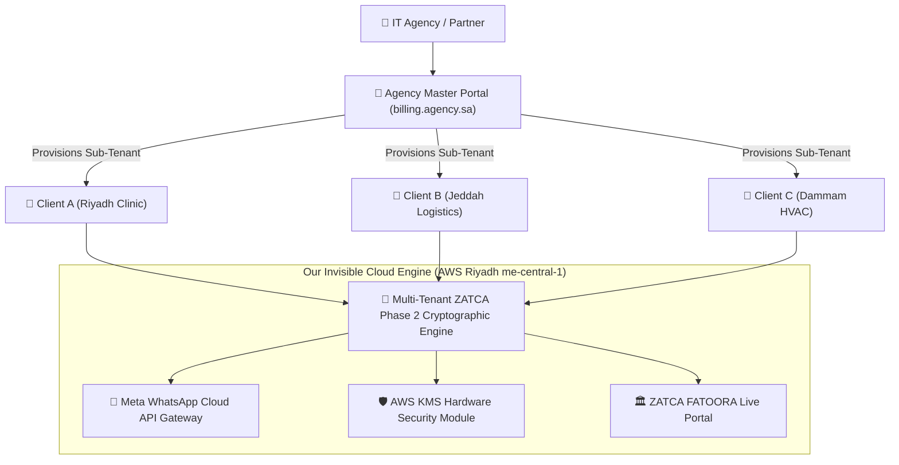

?# Numou ERP — Agency White-Label Partner Program
**Company:** Numou Technologies Limited  
**Product:** Numou ERP  
**Tagline:** Empowering Smart Business Growth.  
**Target Audience:** Saudi IT Agencies, Custom Software Houses, Accounting Firms, ERP Resellers (Odoo / Zoho / SAP B1 Partners), and POS System Vendors  
**Program Objective:** Enable local tech partners to resell Numou ERP's ZATCA Phase 2 Cryptographic Clearance & WhatsApp Invoicing under their own brand with 70%+ gross profit margins.  
**Market Alignment:** Saudi Vision 2030, ZATCA Fatoora Phase 2 Wave Enforcement, and Saudi Cloud Computing Regulatory Framework (CCRF).  
**Location:** `Website/partnerprogram.md`  
**Version:** 2.1 (Numou Brand Architecture Update)  

---

## 1. Executive Summary & Market Opportunity

### 1.1 The Saudi Agency Dilemma (2026)
Across Riyadh, Jeddah, and Dammam, software development and IT agencies face an identical challenge:
* **Every single SME client demands ZATCA Phase 2 compliance** to avoid crippling statutory penalties.
* Building a custom cryptographic engine (canonicalization, SHA-256, ECDSA signing, UBL 2.1 XML, mTLS handshakes, and PIH chaining) costs **SAR 60,000 to SAR 120,000+** in senior engineering overhead per agency.
* Clients are slow to pay emailed invoices, demanding WhatsApp delivery and Mada/Apple Pay integration.

### 1.2 The Partner Program Solution: Powered by Numou Technologies Limited
The **Numou ERP Agency White-Label Program** transforms compliance from a costly custom-development burden into a **high-margin, recurring SaaS revenue stream (MRR)**:
* **100% Brandable:** Deploy a multi-tenant client portal under your own domain (e.g., `billing.youragency.sa`) with your logo, brand colors, and custom WhatsApp sender ID.
* **Plug-and-Play Infrastructure:** Numou Technologies Limited manages the AWS Riyadh hosting (me-central-1), HSM/KMS cryptographic signing, ZATCA clearance API tunnels, and Meta WhatsApp Cloud API webhooks.
* **Instant Provisioning:** Spin up a fully compliant tenant environment for any new client in **under 2 minutes**.
* **Massive Profitability:** Buy wholesale tenant capacity and API packs from Numou ERP; charge your clients standard retail subscription + setup fees and pocket the difference every month.

---

## 2. Partner Economics & Unit Margins (The MRR Engine)

### 2.1 The Reseller Profit Formula
Saudi service businesses routinely pay **SAR 250 to SAR 500 per month** for compliant invoicing and WhatsApp automation. As our partner, your cost per client drops to **SAR 40 - SAR 60/month**, yielding **75% to 84% gross profit margins**.

#### Financial Projection Matrix:
| Number of Active Clients | Typical Retail Price / Client | Total Monthly Revenue | Partner Platform Cost | Net Monthly Profit (MRR) | Net Annual Profit (ARR) |
| :---: | :---: | :---: | :---: | :---: | :---: |
| **15 Clients** | SAR 299 / mo | SAR 4,485 / mo | SAR 899 / mo (Starter) | **SAR 3,586 / mo** | **SAR 43,032 / yr** |
| **30 Clients** | SAR 349 / mo | SAR 10,470 / mo | SAR 1,699 / mo (Growth) | **SAR 8,771 / mo** | **SAR 105,252 / yr** |
| **50 Clients** | SAR 349 / mo | SAR 17,450 / mo | SAR 2,499 / mo (Enterprise) | **SAR 14,951 / mo** | **SAR 179,412 / yr** |
| **100 Clients** | SAR 399 / mo | SAR 39,900 / mo | SAR 2,499 / mo + bulk pack | **SAR 33,400 / mo** | **SAR 400,800 / yr** |

> [!TIP]
> **Additional Revenue Stream (One-Time Setup Fee):** Agencies typically charge clients an onboarding fee of **SAR 1,500 - SAR 3,500** for ZATCA Fatoora portal registration, OTP CSR generation, and template configuration. For 30 clients, that generates an immediate **SAR 45,000 - SAR 105,000 in upfront cash flow**.

---

## 3. Partner Subscription Tiers

| Feature / Benefit | Agency Starter | Agency Growth | Agency Enterprise |
| :--- | :---: | :---: | :---: |
| **Monthly Subscription** | **SAR 899 / mo** | **SAR 1,699 / mo** | **SAR 2,499 / mo** |
| **Annual Billing Discount** | SAR 8,630 / yr *(20% off)* | SAR 16,310 / yr *(20% off)* | SAR 23,990 / yr *(20% off)* |
| **Included Client Sub-Accounts** | **Up to 15 Clients** | **Up to 40 Clients** | **Unlimited Sub-Accounts** |
| **Effective Wholesale Cost / Client** | ~SAR 60 / client / mo | ~SAR 42 / client / mo | Scales down to ~SAR 25 / client |
| **Included Shared Monthly Invoices** | 10,000 Invoices / mo | 30,000 Invoices / mo | 75,000 Invoices / mo |
| **Overage per 1,000 Invoices** | SAR 45 | SAR 35 | SAR 25 |
| **Custom Domain (`*.agency.sa`)** | Agency Subdomain | Custom Subdomain | **Full Root Domain Mapping** |
| **White-Label Branding** | Logo & Favicon | Full CSS & Theme Customization | 100% Unbranded / Pure White-Label |
| **WhatsApp Sender Identity** | Shared High-Throughput Pool | Dedicated Verified Business ID | Multiple Dedicated WABA Profiles |
| **Multi-Tenant Dashboard** | Yes (Single Sign-on) | Yes (RBAC & Client Logins) | Yes (Custom Client Roles & Permissions) |
| **API & Webhook Access** | REST API + Webhooks | REST API + Custom Webhooks | Dedicated High-Speed Queues (Redis) |
| **ZATCA Phase 2 Support** | B2B & B2C Invoicing | B2B, B2C + Credit/Debit Notes | Full ZATCA Sandbox + Auto Onboarding |
| **Partner Support Level** | Standard Email & Ticket (8hr) | Priority WhatsApp Support (2hr) | **24/7 Dedicated Partner Lead & Slack** |
| **Free Client Onboarding Training** | 1 Session | 3 Sessions | **Unlimited 1-on-1 Co-Selling Sessions** |

---

## 4. White-Label Platform Architecture & Technical Capabilities



### 4.1 Master Agency Control Panel (Multi-Tenant Management)
1. **Sub-Account Provisioning:** Create a new client workspace in 60 seconds with company name, CRN, and 15-digit VAT number.
2. **Usage & Quota Allocation:** Set monthly invoice allowances, WhatsApp messaging caps, and credit top-up limits per sub-tenant.
3. **Automated ZATCA OTP Onboarding Wizard:**
   - Step 1: Input taxpayer OTP from ZATCA FATOORA portal.
   - Step 2: System generates cryptographic private key & CSR locally.
   - Step 3: Automatically requests compliance CSID, runs required sample invoices, and vaults Production CSID.
4. **Tenant Data Isolation:** Strict PostgreSQL Row-Level Security (RLS) ensures zero data overlap or cross-visibility between client accounts.

### 4.2 Custom Branding & Personalization
* **Domain Whitelabeling:** Configure CNAME record pointing to `cname.ourplatform.sa` with auto-provisioned Let's Encrypt Wildcard SSL.
* **Custom Color Themes & Logos:** Agency logo displays on client login page, dashboard header, email notifications, and PDF invoice templates.
* **Dedicated WhatsApp Sender ID:** Connect the agency's or each client's official Meta WhatsApp Business Account (WABA) with verified green tick support.

---

## 5. Partner Onboarding & Go-to-Market Journey

```
  [ Day 1 ]                  [ Day 2 ]                  [ Day 3-5 ]               [ Day 7+ ]
Select Tier &           Brand Setup & DNS          Sales Enablement &         First Client Live
Access Sandbox          Configuration              Co-Selling Session         & Recurring MRR
     │                         │                          │                          │
     ▼                         ▼                          ▼                          ▼
• Choose Partner Tier    • Point CNAME to domain    • Receive Partner Kit      • Onboard 1st SME client
• Instant API keys       • Upload logo & favicon    • Sales Pitch Deck PDF     • 10-sec ZATCA clearance
• 100 Free Test Credits  • Connect WABA Profile     • Proposal Templates       • Immediate Cash Flow
```

### Step 1: Portal Access & Sandbox Testing (Day 1)
* Receive credentials to the Agency Master Console.
* Instant access to the ZATCA Sandbox environment with simulated clearance, reporting, and QR verification tools.

### Step 2: Custom Domain & Brand Deployment (Day 2)
* Add DNS records for your chosen domain (e.g., `invoicing.youragency.sa`).
* Upload company branding, color codes, and set default Arabic/English language preference.

### Step 3: Technical & Sales Enablement (Day 3–5)
* 45-minute live onboarding call with a Saudi ZATCA Solutions Architect.
* Access to the **Agency Partner Sales Enablement Kit**:
  - Customer Presentation Pitch Deck (PowerPoint/Keynote & PDF).
  - Client Pricing & Scope of Work (SOW) Contract Templates.
  - ZATCA Phase 2 Wave Enforcement Calendar & Taxpayer Objection Handling Script.

### Step 4: Live Client Onboarding & Revenue Generation (Day 7+)
* Onboard your first live client using the 3-step ZATCA OTP wizard.
* Track usage, automated payments, and monthly recurring margins directly from your analytics dashboard.

---

## 6. Website Page Specification: `/partner-program`

The SaaS website will feature a dedicated, high-converting **Agency Partner Landing Page** located at `/partner-program` (English) and `/ar/partner-program` (Arabic).

### 6.1 Key Page Components
1. **Hero Section:**
   - Headline: *"Build a 6-Figure Invoicing SaaS Under Your Own Agency Brand."*
   - Sub-headline: *"Empower your Saudi clients with automated ZATCA Phase 2 compliance and WhatsApp billing without writing a single line of cryptographic code."*
   - CTAs: `[Apply for Agency Partnership]` | `[Download Partner Pitch Deck (PDF)]`.
2. **Interactive Agency ROI Calculator:**
   - Sliders for *"How many clients do you have?"* and *"What will you charge per client?"*
   - Real-time display of **Agency Gross Revenue**, **Wholesale Platform Cost**, and **Net Annual Profit in SAR**.
3. **Side-by-Side White-Label Preview:**
   - Interactive toggle displaying the unbranded generic dashboard morphing into the agency's customized branded portal with their own logo and domain.
4. **Partner Tier Comparison Table:**
   - Clean, transparent breakdown of Starter (SAR 899), Growth (SAR 1,699), and Enterprise (SAR 2,499).
5. **Partner Application Form:**
   - Fields: Full Name, Company / Agency Name, Business Email, WhatsApp Phone (+966), Estimated Client Base (<10, 10-30, 30-100, 100+), Primary Tech Stack (Odoo, Custom Web, POS, PHP, Node.js).

---

## 7. Partner Program Terms, SLA & Guarantees

* **Data Sovereignty Guarantee:** 100% of tenant data, cryptographic keys, and invoice records remain strictly inside the Kingdom of Saudi Arabia in accordance with NCA and ZATCA regulations.
* **Platform Uptime SLA:** 99.95% availability target backed by multi-AZ AWS Riyadh infrastructure with automated failover.
* **No Lock-In Contract:** Agency subscriptions are billed monthly or annually with full cancellation flexibility at the end of each billing cycle.
* **Client Data Export:** If a client or agency departs, full historical UBL 2.1 XML archives, PDF/A-3 files, and cryptographic hashes are downloadable in standard ZIP bundles conforming to the 6-year ZATCA archiving law.

