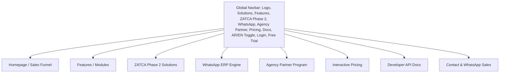
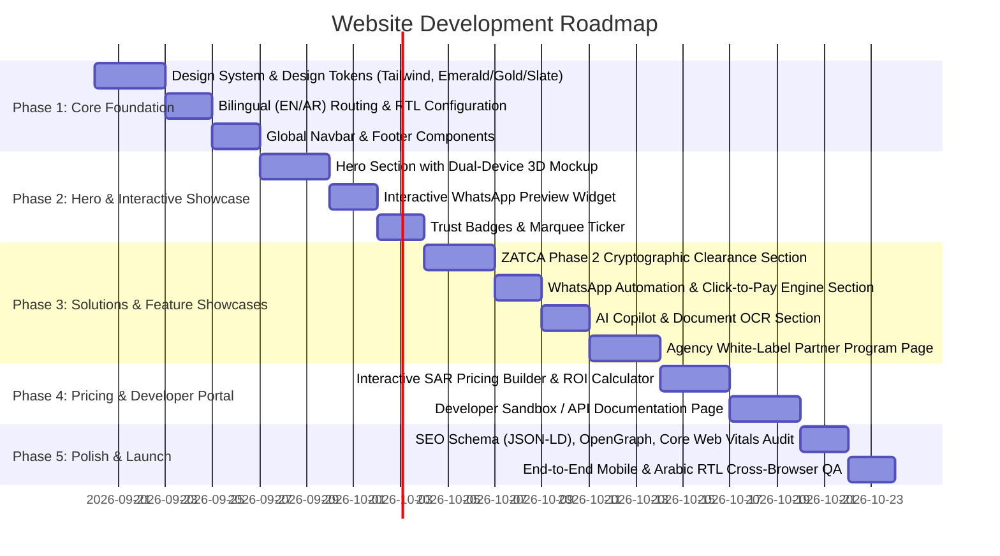

?# Product Requirements Document (PRD) — Numou ERP

**Product Name:** Numou ERP  
**Company:** Numou Technologies Limited  
**Tagline:** Empowering Smart Business Growth. (Arabic: تمكين نمو الأعمال الذكية.)  
**Target Market:** Kingdom of Saudi Arabia (KSA) & GCC  
**Platform Concept:** All-in-One Cloud ERP, Double-Entry Accounting, POS, Inventory, ZATCA Phase 2 Cryptographic Clearance & WhatsApp Automation Engine (with White-Label Agency Reseller Program)  
**Benchmark / Inspiration:** [AmalERP](https://amalerp.com & https://amalerp.com/sa)  
**Location:** `Website/prd.md`  
**Version:** 2.1 (Numou Brand Architecture Update)  

---

## 1. Executive Summary & Product Vision

### 1.1 The Market Context (Saudi Arabia Vision 2030 & ZATCA Wave Mandate)
Saudi Arabia's digital economy is undergoing its largest compliance shift in modern history. The **ZATCA (Zakat, Tax and Customs Authority) Phase 2 Fatoora Integration** is legally mandatory for all taxpayer revenue waves. Concurrently:
- Traditional email invoicing suffers an abysmal **18-24% open rate**, leading to late receivables and severe cash flow bottlenecks.
- **WhatsApp enjoys a 98%+ penetration rate** in Saudi Arabia across both B2B and consumer interactions.
- Local software agencies, POS vendors, and ERP consultants are overwhelmed with ZATCA's cryptographic requirements (UBL 2.1 XML canonicalization, SHA-256 hashing, ECDSA secp256k1 signing, Base64 TLV QR codes, and mTLS clearance APIs).

### 1.2 The Solution: Numou ERP
**Numou ERP**, engineered by **Numou Technologies Limited**, is a unified, hyper-modern AI-powered Cloud ERP platform with the core brand promise: **"Empowering Smart Business Growth."** It uniquely solves both operational and compliance bottlenecks for two distinct customer tracks:
1. **End-User Service Businesses & SMEs:** 1-Click bilingual tax invoicing, instantaneous ZATCA clearance, automatic WhatsApp PDF delivery with click-to-pay buttons (Mada / STC Pay / Apple Pay), POS, inventory, and an AI-powered accounting assistant.
2. **IT Agencies, POS Vendors & ERP Integrators:** A white-label multi-tenant API middleware and reseller portal allowing them to offer ZATCA Phase 2 compliance and WhatsApp billing to hundreds of clients in 15 minutes without building cryptographic infrastructure from scratch.

---

## 2. Competitive Benchmark: AmalERP Analysis & Key Takeaways

From our comprehensive teardown of [AmalERP](https://amalerp.com):

| Architectural Element | AmalERP Benchmark Implementation | Our Adapted & Enhanced Strategy |
| :--- | :--- | :--- |
| **Visual Aesthetics & Palette** | Deep Maroon (`#800020`), Warm Gold (`#D4AF37`), Crisp Ink (`#1A1A1A`), subtle aurora glow drifts, glassy cards with 3D tilt perspective. | Premium Saudi Enterprise aesthetic: **Royal Emerald Green (`#064E3B` / `#059669`) + Desert Gold (`#D4AF37`) + Deep Slate Ink (`#0F172A`)**, with dark mode / light mode toggle and aurora mesh glows. |
| **Proof of Product (Mockups)** | Live floating browser window (`app.amalerp.com`) with animated KPI sparklines, cash-flow forecast, and interactive WhatsApp chat simulation. | **Dual-Device Live Interactive Mockup:** Left side shows live ZATCA FATOORA Clearance portal dashboard with green clearance stamp; Right side shows an interactive mobile WhatsApp preview with clickable PDF and Mada payment link. |
| **Trust & Compliance Signals** | ZATCA Phase 1 QR, FBR/SRB tax badges, 200+ Gulf businesses marquee, client logo ticker. | **Saudi Trust Matrix:** "ZATCA Phase 2 Certified Architecture", "AWS Riyadh Data Residency (me-central-1)", "Vision 2030 Aligned", "Mada & STC Pay Ready", animated marquee of Saudi trade companies. |
| **WhatsApp Integration** | One-tap WhatsApp PDF sending, delivery ticks (`✓✓`), bulk reminders. | **Interactive WhatsApp Invoicing Bot & Pay Button:** Embedded Click-to-Pay URL, real-time read receipt logging, instant payment receipt automation. |
| **AI Features** | AI Studio (document scanning/OCR) and natural language AI query assistant. | **AI Financial Copilot:** Voice/text natural language queries in Arabic & English, automated ZATCA XML schema validation, and intelligent payment reminder scheduling. |
| **Transparent Pricing** | Clear SAR pricing published upfront (`SAR 599/year` / `SAR 1,499/year`), interactive custom plan builder. | **Dual-Track Transparent Pricing:** Interactive toggle switch between **[ Business Packages ]** and **[ Agency / Reseller Packages ]** with dynamic monthly/annual SAR calculator. |
| **Lead Generation** | "Start 7-day trial" + "WhatsApp us" sticky CTA on every section. | **Frictionless Onboarding:** "Start Free Trial (No Card)" + Instant WhatsApp direct chat + "Book 15-Min Live Sandbox Demo". |

---

## 3. Target Audiences & Personas

### Track A: End-User Service Businesses & SMEs
* **Profile:** Maintenance contractors, IT service firms, consulting agencies, clinics, logistics, auto repair, and wholesale traders in Riyadh, Jeddah, Dammam.
* **Core Pain Points:** Fear of massive ZATCA non-compliance penalties, tedious manual PDF creation, delayed payments from clients ignoring emails.
* **Primary Desire:** 100% compliant Arabic/English invoices sent directly to customer WhatsApp with instant online payment collection.

### Track B: Agencies, POS Developers & Software Integrators (The Reseller Engine)
* **Profile:** Digital agencies, custom software houses, ERP implementers (Odoo, Zoho, SAP B1 partners), and legacy POS hardware vendors.
* **Core Pain Points:** High engineering cost and complexity of building ZATCA Phase 2 cryptographic pipelines (mTLS, ECDSA, UBL XML) for dozens of clients.
* **Primary Desire:** A plug-and-play white-label API engine. Resell to clients under their own brand, charge monthly maintenance, and manage everything from a single multi-tenant dashboard.

---

## 4. Website Information Architecture & Page-by-Page Specs



---

### 4.1 Global Navigation Header
* **Branding:** **Numou ERP** (`Numou` in Saudi Royal Emerald `#064E3B`, `ERP` in Desert Gold `#D4AF37`) by **Numou Technologies Limited**.
* **Tagline Display:** "Empowering Smart Business Growth." (subtle below wordmark or in page metadata).
* **Navigation Links:**
  - **Solutions** (Dropdown: For Service Businesses, For IT Agencies, For POS Vendors).
  - **Features** (ZATCA Engine, WhatsApp Invoicing, AI Copilot, POS & Ledger).
  - **Agency Partner** (White-label reseller program & margins).
  - **Pricing** (SAR transparent pricing & ROI calculator).
  - **API Docs** (Swagger/Postman sandbox).
* **Utility Actions:**
  - **Language Switcher:** Instant English ⮂ العربية (Full RTL layout shift).
  - **Sign In** (`app.numouerp.com/login`).
  - **Primary CTA:** `Start Free Trial` (High-contrast emerald button).
  - **WhatsApp Quick-Contact:** Green floating pill icon (`wa.me/+966...`).

---

### 4.2 Homepage (High-Converting Sales Engine)

#### Section 1: Hero Section (Above the Fold)
* **Pill Badge:** `🟢 Numou ERP · ZATCA Phase 2 Certified Architecture · Hosted in AWS Riyadh · 99.99% Uptime`
* **Headline:**
  - *English:* **"Run Your Entire Business on Numou ERP — Saudi Arabia's AI-Powered Cloud ERP, ZATCA Phase 2 & WhatsApp Engine."**
  - *Arabic:* **"أدر أعمالك بالكامل مع بيزورا إي آر بي (Numou ERP) — المنظومة السحابية الذكية للفوترة والامتثال عبر واتساب وزاتكا."**
* **Sub-headline:** **"Empowering Smart Business Growth.** Eliminate compliance headaches, stop chasing overdue payments, and deliver bilingual tax invoices with cryptographic QR codes straight to your customer's WhatsApp in 1 tap."
* **Dual Action Buttons:**
  - `Primary CTA:` Start 14-Day Free Trial (No Credit Card Required) → Opens fast registration modal (`app.numouerp.com/signup`).
  - `Secondary CTA:` [WhatsApp Live Demo] → Direct WhatsApp bot trigger sending an actual sample ZATCA invoice from Numou ERP to user's phone.
* **Hero Visual:**
  - **Interactive 3D Glassmorphism Showcase (AmalERP Style):**
    - Left Window: Live web dashboard preview (`app.numouerp.com`) showing real-time metrics (Revenue in SAR, ZATCA Green Clearance badge `CLEARED #388`, compliance audit score `99/100`).
    - Right Mockup: iPhone frame simulating a real WhatsApp chat with a verified green-badge business profile (`Numou Invoicing Bot`) delivering an interactive invoice card (`INV-2026-00418.pdf`) with **[Pay via Mada]** and **[Download Tax Invoice]** buttons.

#### Section 2: Trust & Compliance Ribbon (Marquee Banner)
* Continuous animated ticker of trust indicators:
  - `🏛️ ZATCA Phase 2 Fatoora Compliant`
  - `🇸🇦 Saudi Cloud Residency (AWS me-central-1 / STC Cloud)`
  - `💳 Mada, Apple Pay, STC Pay Gateway Integration`
  - `🔒 256-bit AES & AWS KMS Hardware Security`
  - `⚡ 200ms API Response Clearance Time`
  - Ticker of trusted Gulf & Saudi client business names.

#### Section 3: The Problem vs. The Solution Matrix
A high-impact comparison table addressing Saudi business realities:
| Legacy Invoicing & Generic ERP | Our ZATCA + WhatsApp Platform |
| :--- | :--- |
| Handcrafted XML & fragile QR codes risk heavy ZATCA fines. | 100% automated canonicalization, cryptographic hashing & clearance API. |
| Invoices sent via email are buried; average collection time is 45+ days. | Delivered to WhatsApp in 2 seconds; 98% open rate; payment collected in minutes. |
| Agencies must build and maintain custom integration code for every client. | Multi-tenant white-label API portal; deploy client ZATCA compliance in 15 mins. |
| Complex, clunky enterprise software taking 3-6 months to implement. | Instant cloud setup; live within 24 hours with remote onboarding. |

#### Section 4: Deep-Dive Feature Modules (AmalERP-Inspired Showcase)

##### Module 1: ZATCA Phase 2 Cryptographic Clearance Engine
* Bilingual Tax Invoices (Standard B2B) and Simplified Tax Invoices (B2C).
* Auto-generation of UBL 2.1 compliant XML.
* ECDSA cryptographic signing & Previous Invoice Hash (PIH) chain maintenance.
* Instant generation of Base64 TLV Phase 2 QR codes.
* Real-time synchronous clearance for B2B and asynchronous 24-hr batch reporting for B2C.

##### Module 2: Native WhatsApp Invoicing & Commerce
* Official WhatsApp Cloud API framework (zero risk of number banning).
* Automated branded PDF generation and dynamic template injection.
* Embedded Click-to-Pay links (Moyasar, PayTabs, HyperPay).
* Automated payment reminder sequences on due dates.
* Live delivery logs with read receipts (`Sent`, `Delivered`, `Read`).

##### Module 3: AI Financial Copilot & Automated Bookkeeping
* **AI Document Reader:** Scan or upload vendor receipts/PDFs; AI parses line items, VAT, and creates draft journal entries.
* **Natural Language AI Assistant:** Ask questions in conversational Arabic or English (*"كم كانت أرباحنا الشهر الماضي ومن هم أكبر 3 عملاء؟"* / *"What were my top overdue invoices this week?"*).
* **Automatic Bank Reconciliation:** Matches bank feed transactions against issued invoices.

##### Module 4: Agency White-Label & Reseller Portal
* Custom branding: Agency's own logo, favicon, and custom subdomain (`invoicing.youragency.sa`).
* Multi-tenant client management: Provision, monitor, and configure client API keys from a unified control panel.
* Wholesale credit pricing: Buy API volume in bulk and set custom retail margins.

#### Section 5: Interactive Pricing & Custom Plan Builder
* **Audience Toggle:** **[ For Service Businesses & SMEs ]** | **[ For IT Agencies & Developers ]**
* **Billing Toggle:** Monthly | Annual (Save 20% + Free ZATCA Onboarding)
* **Tier Cards (Track 1 — Businesses):**
  - **Starter (SAR 149/mo):** Up to 500 invoices/mo, ZATCA Phase 1 & 2 QR, WhatsApp PDF sending, 2 user seats.
  - **Business Pro (SAR 449/mo):** Up to 3,000 invoices/mo, full ZATCA Clearance API, automated payment reminders, payment gateway integration, AI assistant.
* **Tier Cards (Track 2 — Agencies & Resellers):**
  - **Agency Starter (SAR 899/mo):** Up to 15 Client sub-accounts, white-label dashboard, 10,000 shared invoices/mo, priority SLA.
  - **Agency Growth (SAR 1,699/mo):** Up to 40 Client sub-accounts, custom subdomain, 30,000 shared invoices/mo, dedicated WhatsApp sender ID.
  - **Agency Enterprise (SAR 2,499/mo):** Unlimited sub-accounts, full custom domain mapping, 75,000 invoices/mo, dedicated Redis queues, 24/7 WhatsApp VIP support.
* **Interactive Plan Customizer:** Sliders to customize invoice volume, extra branches, and WhatsApp message packs with instant real-time SAR calculation.

#### Section 6: Customer Case Studies & Social Proof
* Real-world success stories (e.g., *"How a Riyadh HVAC contractor collected SAR 340,000 in overdue invoices within 7 days using WhatsApp Click-to-Pay"*).
* Video testimonial carousel and client quotes.

#### Section 7: Frequently Asked Questions (FAQ Accordion)
* *Is our invoice data stored inside the Kingdom of Saudi Arabia?* (Yes, 100% compliant with Saudi Cloud Computing Regulatory Framework in AWS Riyadh).
* *How do we connect our official ZATCA Fatoora credentials?* (Guided 3-step OTP compliance onboarding wizard).
* *Does this work with my existing ERP (Odoo / Excel / QuickBooks)?* (Yes, via REST API webhooks or bulk Excel upload).
* *Can our customers pay directly from WhatsApp?* (Yes, via Mada, Apple Pay, Visa, and STC Pay links).

#### Section 8: High-Conversion Sticky Footer & Final CTA
* Banner: *"Stop risking ZATCA penalties. Empowering Smart Business Growth.with Numou ERP."*
* Dual CTAs: `[Start 14-Day Free Trial]` and `[Chat with a Saudi Specialist on WhatsApp]`.
* Complete footer links, legal policies (ZATCA compliance, Privacy, Terms), and company registration:
  - **Corporate Entity:** Numou Technologies Limited
  - **Product Line:** Numou ERP Cloud Platform
  - **Tagline:** Empowering Smart Business Growth.
  - **Regional Presence:** Riyadh, Saudi Arabia & Global Offices.

---

### 4.3 Dedicated Agency Partner Landing Page (`/partner-program`)
*(Full Blueprint documented in [`partnerprogram.md`](file:///e:/aiprojects/UAE-Invoice/Website/partnerprogram.md))*
* **Target Audience:** IT agencies, ERP implementers, and accounting firms looking to resell ZATCA compliance.
* **Hero Headline:** *"Build a 6-Figure Invoicing SaaS Under Your Own Agency Brand."*
* **Interactive ROI Calculator:** Real-time calculator projecting agency net profit based on client count and retail subscription pricing.
* **White-Label Visual Switcher:** Live interactive demo toggling between generic UI and agency-branded UI (`billing.youragency.sa`).
* **Wholesale Tier Breakdown:** Detailed comparison of Agency Starter (SAR 899), Growth (SAR 1,699), and Enterprise (SAR 2,499).
* **Partner Application Form:** Frictionless onboarding capture form linked directly to partner portal provisioning.
* **Lead Magnet Integration:** Instant download for *"The Saudi Agency White-Label Partner Pitch Deck & Sales Kit (PDF)"*.

---

## 5. UI/UX Design System (AmalERP + Saudi Modern Aesthetic)

### 5.1 Color Palette
* **Primary Brand:** Saudi Royal Emerald (`#064E3B` / `#059669`) — signifies trust, compliance, and Saudi heritage.
* **Luxury Accent:** Desert Gold (`#D4AF37` / `#F59E0B`) — highlights badges, highlights, and VIP tiers.
* **WhatsApp Native:** Official WhatsApp Green (`#25D366` / `#128C7E`) — used for chat previews and messaging CTAs.
* **Backgrounds:**
  - Light Mode: `#F8FAFC` (Clean porcelain slate) with `#FFFFFF` cards and `#F1F5F9` subtle borders.
  - Dark Mode: `#0F172A` (Deep navy midnight) with `#1E293B` elevated surfaces.
* **Typography:**
  - English: `Plus Jakarta Sans` or `Inter` (geometric, modern, high-tech).
  - Arabic: `IBM Plex Sans Arabic` or `Cairo` (refined, highly legible, professional corporate tone).

### 5.2 Micro-Interactions & Animation Standards
* **Aurora Gradients:** Gentle floating radial gradients behind hero sections (`opacity: 0.25`, slow float).
* **Perspective Tilt Cards:** 3D subtle tilt (`perspective: 1600px`, `transform: rotateX/rotateY`) on feature cards upon mouse hover.
* **Live Counters:** Animated numeric rolling counts for revenue, invoices cleared, and seconds saved.
* **RTL First-Class Architecture:** Seamless CSS mirroring (`dir="rtl"`) with mirrored icons and direction-aware layout containers.

---

## 6. Technical Stack & Implementation Architecture

```
                 ┌──────────────────────────────────────────────┐
                 │       Frontend: Next.js (App Router)         │
                 │   TypeScript · Tailwind CSS · Framer Motion  │
                 │     Lucide Icons · Next-Intl (Bilingual)     │
                 └──────────────────────┬───────────────────────┘
                                        │
                 ┌──────────────────────┴───────────────────────┐
                 │      Edge Layer & API Middleware Gateway     │
                 │  Next.js Server Actions & Route Handlers     │
                 │  Vercel Edge / AWS CloudFront (Middle East)  │
                 └──────────────────────┬───────────────────────┘
                                        │
          ┌─────────────────────────────┼─────────────────────────────┐
          ▼                             ▼                             ▼
┌──────────────────┐          ┌──────────────────┐          ┌──────────────────┐
│   ZATCA Engine   │          │  WhatsApp Cloud  │          │   PostgreSQL &   │
│  (Crypto, mTLS,  │          │   (Meta Graph    │          │  Drizzle ORM &   │
│   UBL 2.1 XML)   │          │   v21.0 Webhook) │          │  (AWS me-cent-1) │
└──────────────────┘          └──────────────────┘          └──────────────────┘
```

* **Core Framework:** Next.js (App Router) with React 19 and TypeScript.
* **Styling:** Tailwind CSS with `@tailwindcss/typography`, container queries, and RTL support.
* **Internationalization (i18n):** `next-intl` supporting `en` and `ar` with automatic browser language detection and persistent locale routing (`/en`, `/ar`).
* **Interactive Animations:** Framer Motion for smooth scroll reveals, marquee animations, and card hover physics.
* **Forms & Lead Capture:** React Hook Form + Zod validation connected to webhook pipelines (Slack/WhatsApp notification + CRM).
* **SEO & Core Web Vitals:** Next.js Metadata API, JSON-LD Schema markup:
  - `Organization`: `"name": "Numou Technologies Limited"`, `"url": "https://numouerp.com"`
  - `SoftwareApplication`: `"name": "Numou ERP"`, `"description": "Numou ERP — Empowering Smart Business Growth. AI-powered cloud ERP, double-entry accounting, POS, ZATCA Phase 2 e-invoicing and WhatsApp automation in Saudi Arabia."`
  - `FAQPage` Schema for Saudi VAT & ZATCA wave compliance questions.
  - Dynamic sitemap, and Open Graph cards (`https://numouerp.com/assets/og.png`) for KSA localized sharing.

---

## 7. Conversion Funnel & Lead Capture Strategy

1. **Instant WhatsApp Simulator on Hero:**
   - Visitors can type their mobile number into an interactive hero widget to receive an actual sample bilingual ZATCA Phase 2 PDF invoice on their own WhatsApp within 10 seconds.
2. **Interactive ZATCA Phase 2 Penalty Calculator:**
   - Input business turnover and current invoicing method to calculate the estimated non-compliance penalty under ZATCA regulations, creating urgency.
3. **Agency Partner Deck Download:**
   - High-value lead magnet: *"The Saudi Agency Guide to Selling ZATCA Compliance as a SaaS"* requiring email and company name.
4. **Instant Sandbox API Credentials:**
   - Developers can generate a temporary API token in 1 click to test the clearance endpoint directly in Postman or Curl.

---

## 8. Development Roadmap & Phased Execution



---

## 9. Success Metrics & KPIs
* **Lighthouse Performance Score:** > 95 on both Mobile and Desktop.
* **First Contentful Paint (FCP):** < 1.0s on GCC Edge connections.
* **Lead Conversion Rate:** > 6.5% overall visitor-to-lead rate (Trial signups + WhatsApp demos).
* **Agency Partner Inquiries:** > 25 qualified agency partner leads per month.
* **ZATCA Keyword Organic Search Ranking:** Top 3 in Saudi Google searches for *"ZATCA Phase 2 API Saudi Arabia"* and *"WhatsApp Invoicing KSA"*.

