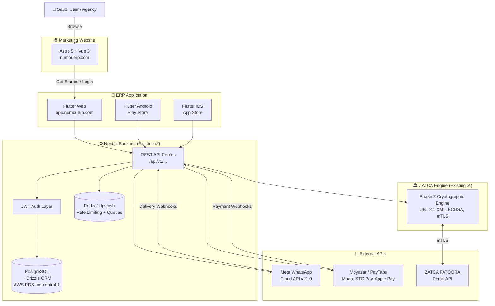
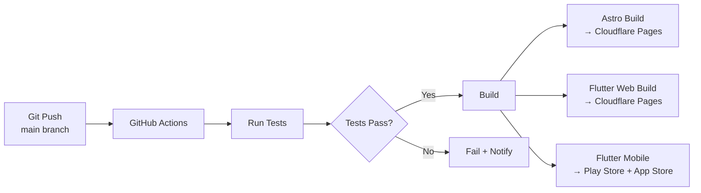

# Numou ERP — Full Product Requirements Document (ERP PRD)

**Company:** Numou Technologies Limited  
**Product:** Numou ERP  
**Tagline:** Empowering Smart Business Growth. | تمكين نمو الأعمال الذكية.  
**Target Market:** Kingdom of Saudi Arabia (KSA) + GCC Region  
**Version:** 1.0 (Unified Full-Stack ERP Architecture)  
**Date:** 2026-09-21  

---

## Table of Contents

1. [Executive Summary](#1-executive-summary)
2. [Ecosystem Architecture](#2-ecosystem-architecture)
3. [Folder & Project Structure](#3-folder--project-structure)
4. [Marketing Website — Astro + Vue](#4-marketing-website--astro--vue)
5. [ERP Frontend — Flutter](#5-erp-frontend--flutter)
6. [Backend API — Next.js](#6-backend-api--nextjs)
7. [ZATCA Engine — Separate Service](#7-zatca-engine--separate-service)
8. [Multi-Language & RTL Architecture](#8-multi-language--rtl-architecture)
9. [Design System & UI Standards](#9-design-system--ui-standards)
10. [ERP Feature Modules](#10-erp-feature-modules)
11. [Agency White-Label Program](#11-agency-white-label-program)
12. [Security Architecture](#12-security-architecture)
13. [Database Schema](#13-database-schema)
14. [Deployment Architecture](#14-deployment-architecture)
15. [Success Metrics & KPIs](#15-success-metrics--kpis)

---

## 1. Executive Summary

### 1.1 The Market Context (Saudi Arabia Vision 2030)

Saudi Arabia's digital economy is undergoing its largest compliance shift in modern history. The **ZATCA Phase 2 Fatoora Integration** is legally mandatory for all taxpayer revenue waves:

- Traditional email invoicing suffers an **18-24% open rate** → late receivables, severe cash flow bottlenecks
- **WhatsApp enjoys 98%+ penetration** in Saudi Arabia across B2B and consumer interactions
- Local software agencies are overwhelmed with ZATCA's cryptographic requirements (UBL 2.1 XML, SHA-256, ECDSA secp256k1, Base64 TLV QR codes, mTLS)
- Non-compliance penalties: **SAR 10,000+ per violation**

### 1.2 The Solution: Numou ERP

**Numou ERP** is a unified, hyper-modern AI-powered Cloud ERP platform with the core promise: **"Empowering Smart Business Growth."**

**Two customer tracks:**

| Track | Target | Core Value |
|---|---|---|
| **Track A — SME/Service Business** | Maintenance, IT, Clinics, Logistics, Restaurants | 1-Click ZATCA compliant invoicing + WhatsApp PDF delivery + Click-to-Pay |
| **Track B — Agencies/Resellers** | IT Agencies, POS Vendors, ERP Integrators | White-label multi-tenant API portal — deploy ZATCA compliance for clients in 15 mins |

### 1.3 Product Ecosystem Overview

```
numouerp.com           → Marketing Website (Astro + Vue) — Arabic SEO ✅
app.numouerp.com       → ERP Dashboard (Flutter Web)
Play Store + App Store  → ERP Mobile App (Flutter Android + iOS)
api.numouerp.com       → Backend API (Next.js) ← Already built ✅
zatca.numouerp.com     → ZATCA Engine (Separate service) ← Already built ✅
```

---

## 2. Ecosystem Architecture



---

## 3. Folder & Project Structure

### 3.1 Top-Level Repository Layout

```
Zatca_website/                    ← Root repository
│
├── Website/                      ← 🌐 MARKETING WEBSITE (Astro + Vue)
│   ├── src/
│   ├── public/
│   ├── astro.config.mjs
│   ├── tailwind.config.mjs
│   ├── tsconfig.json
│   └── package.json
│
├── erp-frontend/                 ← 📱 ERP FRONTEND (Flutter)
│   ├── lib/
│   ├── test/
│   ├── android/
│   ├── ios/
│   ├── web/
│   ├── assets/
│   └── pubspec.yaml
│
├── docs/                         ← 📄 Documentation (existing)
│   ├── architecture.md
│   ├── database.md
│   ├── dfd.md
│   ├── prd.md
│   ├── ideas.md
│   ├── layout.md
│   ├── partnerprogram.md
│   └── wireframestructure.md
│
├── erp_prd.md                    ← 📋 THIS FILE — Full ERP PRD
└── README.md
```

> **Note:** Backend (`api.numouerp.com`) and ZATCA Engine are separate repositories, not in this folder.

### 3.2 Marketing Website — `Website/` Folder Structure

```
Website/                          ← Astro + Vue marketing site
├── src/
│   ├── layouts/
│   │   └── BaseLayout.astro      # HTML shell: head, meta, hreflang, fonts, RTL/LTR
│   │
│   ├── pages/
│   │   ├── index.astro           # Root → redirects to /ar/ (Saudi first)
│   │   ├── robots.txt.ts         # Auto-generated robots.txt
│   │   ├── sitemap-index.xml.ts  # Auto-generated bilingual sitemap
│   │   │
│   │   ├── ar/                   # 🇸🇦 Arabic pages (RTL, primary)
│   │   │   ├── index.astro       # الرئيسية
│   │   │   ├── features.astro    # المميزات
│   │   │   ├── pricing.astro     # الأسعار
│   │   │   ├── demo.astro        # التجربة
│   │   │   ├── about.astro       # من نحن
│   │   │   ├── contact.astro     # تواصل معنا
│   │   │   ├── partner.astro     # برنامج الوكالاء
│   │   │   └── blog/
│   │   │       ├── index.astro
│   │   │       └── [slug].astro  # Individual blog posts
│   │   │
│   │   ├── en/                   # 🇬🇧 English pages (LTR, secondary)
│   │   │   ├── index.astro
│   │   │   ├── features.astro
│   │   │   ├── pricing.astro
│   │   │   ├── demo.astro
│   │   │   ├── about.astro
│   │   │   ├── contact.astro
│   │   │   ├── partner.astro
│   │   │   └── blog/
│   │   │       ├── index.astro
│   │   │       └── [slug].astro
│   │   │
│   │   └── [ur]/                 # 🇵🇰 Urdu pages (RTL) — Phase 2
│   │       └── index.astro
│   │
│   ├── components/
│   │   ├── layout/               # Static Astro components (0 JS)
│   │   │   ├── Navbar.astro
│   │   │   ├── Footer.astro
│   │   │   ├── MobileNav.astro
│   │   │   └── PageHero.astro
│   │   │
│   │   ├── sections/             # Static page sections (0 JS)
│   │   │   ├── TrustMarquee.astro
│   │   │   ├── FeatureGrid.astro
│   │   │   ├── ComparisonTable.astro
│   │   │   ├── TestimonialSlider.astro
│   │   │   ├── HowItWorks.astro
│   │   │   ├── CtaSection.astro
│   │   │   └── AgencyEconomics.astro
│   │   │
│   │   ├── islands/              # 🏝️ Vue Islands (interactive, JS hydrated on demand)
│   │   │   ├── PricingToggle.vue         # Monthly/Yearly + Business/Agency
│   │   │   ├── FaqAccordion.vue          # Expandable FAQ
│   │   │   ├── RoiCalculator.vue         # Agency profit calculator
│   │   │   ├── PenaltyCalculator.vue     # ZATCA penalty risk calculator
│   │   │   ├── ContactForm.vue           # Form with validation
│   │   │   ├── DemoRequestForm.vue       # WhatsApp demo request
│   │   │   ├── PartnerApplyForm.vue      # Agency partner application
│   │   │   ├── LanguageSwitcher.vue      # AR/EN/UR toggle
│   │   │   ├── MobileMenuToggle.vue      # Hamburger menu
│   │   │   ├── CounterAnimation.vue      # Animated stats
│   │   │   └── WhatsAppSimulator.vue     # Interactive WA preview
│   │   │
│   │   └── ui/
│   │       ├── Button.astro
│   │       ├── Badge.astro
│   │       ├── Card.astro
│   │       └── SectionHeader.astro
│   │
│   ├── content/                  # Astro Content Collections
│   │   ├── config.ts
│   │   └── blog/
│   │       ├── ar/               # Arabic blog posts (.md / .mdx)
│   │       └── en/               # English blog posts (.md / .mdx)
│   │
│   ├── i18n/
│   │   ├── ar.json               # Arabic UI strings
│   │   ├── en.json               # English UI strings
│   │   ├── ur.json               # Urdu UI strings (Phase 2)
│   │   └── utils.ts              # t() helper function + locale utilities
│   │
│   ├── data/                     # Static data files (TypeScript)
│   │   ├── pricing.ts            # Pricing tiers, SAR amounts
│   │   ├── features.ts           # Feature list data
│   │   ├── faq.ts                # FAQ items (ar + en)
│   │   ├── testimonials.ts       # Client testimonials
│   │   └── nav.ts                # Navigation links
│   │
│   └── styles/
│       └── global.css            # Tailwind base + CSS custom properties
│
├── public/
│   ├── images/
│   │   ├── mockups/              # Dashboard + phone mockup visuals
│   │   ├── badges/               # ZATCA, AWS Riyadh, Mada, Vision 2030
│   │   └── clients/              # Saudi client logos
│   ├── og/
│   │   ├── og-ar.png             # 1200x630 Arabic Open Graph image
│   │   └── og-en.png             # 1200x630 English Open Graph image
│   └── favicon.svg
│
├── astro.config.mjs
├── tailwind.config.mjs
├── tsconfig.json
└── package.json
```

### 3.3 ERP Frontend — `erp-frontend/` Folder Structure

```
erp-frontend/                     ← Flutter ERP app
├── lib/
│   ├── main.dart                 # Entry point
│   ├── app.dart                  # MaterialApp.router + providers
│   │
│   ├── core/
│   │   ├── constants/
│   │   │   ├── app_colors.dart   # Design tokens (Emerald, Gold, Slate)
│   │   │   ├── app_typography.dart # Font families (EN: Jakarta Sans, AR: IBM Plex)
│   │   │   ├── app_spacing.dart
│   │   │   └── api_endpoints.dart
│   │   ├── theme/
│   │   │   ├── app_theme.dart    # Light + Dark theme
│   │   │   └── rtl_theme.dart    # Arabic RTL overrides
│   │   ├── network/
│   │   │   ├── dio_client.dart
│   │   │   ├── auth_interceptor.dart
│   │   │   └── api_exceptions.dart
│   │   ├── routing/
│   │   │   ├── app_router.dart   # go_router config
│   │   │   └── route_names.dart
│   │   ├── l10n/                 # Flutter i18n
│   │   │   ├── app_ar.arb        # Arabic strings
│   │   │   ├── app_en.arb        # English strings
│   │   │   └── app_ur.arb        # Urdu strings (Phase 2)
│   │   └── utils/
│   │       ├── validators.dart
│   │       └── sar_formatter.dart
│   │
│   ├── features/
│   │   ├── auth/                 # Login, Register, Forgot Password
│   │   ├── dashboard/            # KPIs, Charts, ZATCA Status
│   │   ├── invoicing/            # Create, List, Detail, QR
│   │   ├── clients/              # Client CRUD
│   │   ├── whatsapp/             # Delivery logs, Templates
│   │   ├── payments/             # Payment tracking
│   │   ├── agency/               # Multi-tenant management
│   │   ├── reports/              # Analytics & exports
│   │   └── settings/             # Profile, Language, Theme
│   │
│   └── shared/
│       └── widgets/
│           ├── app_scaffold.dart  # Responsive shell
│           ├── responsive_builder.dart
│           └── ...
│
├── assets/
│   ├── images/
│   ├── icons/
│   ├── fonts/
│   └── translations/
│       ├── ar.json
│       ├── en.json
│       └── ur.json
│
├── test/
├── android/
├── ios/
├── web/
└── pubspec.yaml
```

---

## 4. Marketing Website — Astro + Vue

### 4.1 Technology Stack

| Layer | Technology | Version | Reason |
|---|---|---|---|
| **Framework** | Astro | 5.x | Zero-JS static output, Island architecture, best SEO |
| **UI Components** | Vue 3 | 3.5+ | Interactive islands (pricing, FAQ, forms) |
| **Styling** | Tailwind CSS | v4 | Auto-purged CSS (~6KB output) |
| **i18n** | Custom + `astro-i18n-aut` | — | `/ar/`, `/en/`, `/ur/` routing |
| **Fonts** | Fontsource | — | Self-hosted, zero CLS |
| **Sitemap** | `@astrojs/sitemap` | — | Auto-generated bilingual sitemap |
| **Images** | Astro `<Image />` | built-in | Auto WebP/AVIF, lazy load |
| **Analytics** | Plausible | — | Privacy-friendly, GDPR |
| **Deploy** | Cloudflare Pages | — | Free, global CDN, KSA edge |

### 4.2 Supported Languages (Marketing)

| Language | Code | Direction | Status |
|---|---|---|---|
| Arabic (Saudi) | `ar` | RTL → | ✅ Phase 1 — Primary |
| English | `en` | LTR ← | ✅ Phase 1 |
| Urdu | `ur` | RTL → | 🔄 Phase 2 |
| Hindi | `hi` | LTR ← | 🔄 Phase 3 |

**Default redirect:** `numouerp.com/` → `/ar/` (Saudi-first)

### 4.3 Pages & Sitemap

| Route (AR) | Route (EN) | Content |
|---|---|---|
| `/ar/` | `/en/` | Homepage — Hero, Trust Ribbon, Problem/Solution, Features, Pricing CTA, Testimonials, FAQ |
| `/ar/features/` | `/en/features/` | Deep-dive feature modules (ZATCA, WhatsApp, AI Copilot, POS) |
| `/ar/pricing/` | `/en/pricing/` | Interactive SAR pricing toggle + comparison table + ROI calculator |
| `/ar/demo/` | `/en/demo/` | WhatsApp Simulator + Sandbox API demo |
| `/ar/partner/` | `/en/partner/` | Agency Partner Program — economics, tiers, apply form |
| `/ar/about/` | `/en/about/` | Company, team, vision, AWS Riyadh compliance |
| `/ar/contact/` | `/en/contact/` | Contact form + WhatsApp direct + office locations |
| `/ar/blog/` | `/en/blog/` | Content marketing — ZATCA guides, Saudi VAT news |
| `/ar/blog/[slug]` | `/en/blog/[slug]` | Individual blog post |

### 4.4 Island Architecture (Astro Hydration Strategy)

```
Page Shell (.astro) — Zero JavaScript
├── Navbar.astro              → 0 JS  (static HTML)
├── PageHero.astro            → 0 JS  (static HTML)
├── TrustMarquee.astro        → 0 JS  (CSS animation only)
├── FeatureGrid.astro         → 0 JS  (static HTML)
│
├── PricingToggle.vue         → ⚡ client:visible  (~3KB JS)
├── FaqAccordion.vue          → ⚡ client:visible  (~1.5KB JS)
├── RoiCalculator.vue         → ⚡ client:visible  (~4KB JS)
├── ContactForm.vue           → ⚡ client:visible  (~3KB JS)
├── LanguageSwitcher.vue      → ⚡ client:load     (~0.5KB JS)
├── MobileMenuToggle.vue      → ⚡ client:load     (~0.5KB JS)
│
└── Footer.astro              → 0 JS  (static HTML)

Total JS sent to browser: ~12KB (vs 56KB current)
```

### 4.5 Arabic SEO Architecture

```html
<!-- Build output for /ar/pricing/ -->
<html lang="ar" dir="rtl">
<head>
  <!-- hreflang: all language versions -->
  <link rel="alternate" hreflang="ar" href="https://numouerp.com/ar/pricing/" />
  <link rel="alternate" hreflang="en" href="https://numouerp.com/en/pricing/" />
  <link rel="alternate" hreflang="x-default" href="https://numouerp.com/ar/pricing/" />
  <link rel="canonical" href="https://numouerp.com/ar/pricing/" />

  <!-- JSON-LD Structured Data -->
  <script type="application/ld+json">{
    "@context": "https://schema.org",
    "@type": "SoftwareApplication",
    "name": "نومو إي آر بي",
    "applicationCategory": "BusinessApplication",
    "offers": [{
      "@type": "Offer",
      "priceCurrency": "SAR",
      "price": "299",
      "name": "Business Plan"
    }],
    "operatingSystem": "Web, Android, iOS"
  }</script>
</head>
```

**SEO Checklist per page:**
- [ ] `<title>` in Arabic (primary) 
- [ ] `<meta name="description">` in Arabic (155 chars max)
- [ ] `<h1>` — one per page, Arabic keyword-rich
- [ ] hreflang tags for ar + en + x-default
- [ ] Canonical URL
- [ ] Open Graph tags (og:locale = ar_SA)
- [ ] JSON-LD structured data (Organization, Product, FAQ, BreadcrumbList)
- [ ] Image alt text in Arabic
- [ ] `dir="rtl"` on `<html>`

---

## 5. ERP Frontend — Flutter

### 5.1 Technology Stack

| Layer | Technology | Version | Reason |
|---|---|---|---|
| **Framework** | Flutter | 3.27+ | Web + Android + iOS from one codebase |
| **Language** | Dart | 3.7+ | Type-safe, null-safe |
| **State** | Riverpod | 2.6+ | Reactive, testable, scalable |
| **Routing** | go_router | 14.x | URL-based, deep linking, Web URL support |
| **HTTP** | Dio + Retrofit | — | Type-safe REST API client with interceptors |
| **Models** | Freezed + json_serializable | — | Immutable models, JSON serialization |
| **UI** | flutter_animate + fl_chart | — | Animations + charts |
| **i18n** | flutter_localizations + intl | — | Arabic RTL + multi-language |
| **Auth Storage** | flutter_secure_storage | — | Encrypted JWT (Keychain/Keystore) |
| **Biometric** | local_auth | — | Fingerprint/Face ID |
| **Offline** | Hive | 4.x | Local cache for offline use |
| **Deploy Web** | Cloudflare Pages | — | `app.numouerp.com` |
| **Deploy Mobile** | Play Store + App Store | — | Production builds |

### 5.2 Supported Languages (ERP App)

| Language | Code | Direction | Font | Status |
|---|---|---|---|---|
| Arabic (Saudi) | `ar` | RTL | IBM Plex Sans Arabic | ✅ Phase 1 |
| English | `en` | LTR | Plus Jakarta Sans | ✅ Phase 1 |
| Urdu | `ur` | RTL | Noto Nastaliq Urdu | 🔄 Phase 2 |

**Language switching:** Instant, persisted in `shared_preferences`, no app restart needed.

### 5.3 ERP Modules

| Module | Features |
|---|---|
| **Dashboard** | KPI cards (Revenue, Invoices Cleared, Overdue SAR), Revenue chart, ZATCA health status, Recent activity |
| **Invoicing** | Create ZATCA-compliant invoice, View list (filter/search), Invoice detail with QR, Share PDF, WhatsApp send |
| **Clients** | Add/Edit/Delete clients, Client invoice history, Saudi CRN validation |
| **WhatsApp** | Delivery logs (Sent/Delivered/Read), Template management, Bulk send |
| **Payments** | Payment links, Transaction history, Moyasar/PayTabs integration |
| **Agency** | Multi-tenant list, Add tenant, Tenant usage stats, API key management |
| **Reports** | Revenue by period, VAT reports (ZATCA format), Export CSV/PDF |
| **Settings** | Profile, Language (AR/EN/UR), Dark/Light mode, Notification preferences, Billing |

### 5.4 Architecture Pattern (Feature-First Clean Architecture)

```
Each feature module:
features/invoicing/
├── data/
│   ├── invoice_repository.dart    # Implementation
│   └── invoice_api.dart           # Retrofit API interface
├── domain/
│   ├── invoice_model.dart         # Freezed immutable model
│   └── zatca_status.dart          # Enums
├── presentation/
│   ├── invoice_list_screen.dart
│   ├── create_invoice_screen.dart
│   ├── invoice_detail_screen.dart
│   └── widgets/
│       ├── invoice_card.dart
│       ├── qr_code_widget.dart
│       └── zatca_clearance_badge.dart
└── providers/
    └── invoice_provider.dart      # Riverpod providers
```

### 5.5 Responsive Layout

```
Desktop Web (≥1200px):   Side Drawer + Main Content (2-column)
Tablet (600–1199px):     Collapsible Drawer + Main Content
Mobile (<600px):         Bottom Navigation Bar + Full-screen content
```

---

## 6. Backend API — Next.js

> ✅ **Already built as a separate project.** This section documents the contract.

### 6.1 API Endpoints (Contract)

| Route | Method | Purpose | Auth |
|---|---|---|---|
| `/api/health` | GET | Health check | None |
| `/api/v1/auth/login` | POST | Login → JWT | None |
| `/api/v1/auth/register` | POST | Register new account | None |
| `/api/v1/auth/refresh` | POST | Refresh JWT token | Refresh token |
| `/api/v1/invoices` | GET | List invoices | Bearer JWT |
| `/api/v1/invoices` | POST | Create invoice → ZATCA clearance | Bearer JWT |
| `/api/v1/invoices/:id` | GET | Invoice detail + QR | Bearer JWT |
| `/api/v1/clients` | GET/POST/PUT/DELETE | Client CRUD | Bearer JWT |
| `/api/v1/whatsapp/send` | POST | Send invoice to WhatsApp | Bearer JWT |
| `/api/v1/payments/link` | POST | Generate Click-to-Pay link | Bearer JWT |
| `/api/v1/agency/tenants` | GET/POST | Agency multi-tenant management | Bearer JWT + Agency role |
| `/api/v1/reports/vat` | GET | VAT report export | Bearer JWT |
| `/api/v1/leads` | POST | Marketing lead capture | Rate limited (5/min) |
| `/api/v1/demo-simulator` | POST | WhatsApp demo trigger | Rate limited (3/hr) |

### 6.2 Authentication Flow

```
Flutter App ──[POST /auth/login {phone, password}]──► Next.js Backend
Next.js Backend ──[200 {accessToken, refreshToken}]──► Flutter App
Flutter App ──[store in flutter_secure_storage]──► Encrypted

Every API call:
Flutter App ──[Authorization: Bearer <accessToken>]──► Next.js Backend
If 401: Auto-refresh via /auth/refresh ──► retry original request
If refresh fails: Logout → Login screen
```

---

## 7. ZATCA Engine — Separate Service

> ✅ **Already built as a separate project.** Called internally by Next.js Backend.

### 7.1 Capabilities
- UBL 2.1 XML generation (Standard B2B + Simplified B2C)
- ECDSA secp256k1 cryptographic signing
- Previous Invoice Hash (PIH) chain maintenance
- Base64 TLV Phase 2 QR code generation
- SHA-256 invoice hashing
- mTLS authentication with ZATCA FATOORA Portal
- Synchronous clearance (B2B) + Asynchronous reporting (B2C)
- CSID (Cryptographic Stamp Identifier) onboarding

---

## 8. Multi-Language & RTL Architecture

### 8.1 Language Support Matrix

| Language | Marketing Site | ERP App | Direction | Font |
|---|---|---|---|---|
| **Arabic (SA)** 🇸🇦 | ✅ Phase 1 (Primary) | ✅ Phase 1 | RTL | IBM Plex Sans Arabic |
| **English** 🇬🇧 | ✅ Phase 1 | ✅ Phase 1 | LTR | Plus Jakarta Sans |
| **Urdu** 🇵🇰 | 🔄 Phase 2 | 🔄 Phase 2 | RTL | Noto Nastaliq Urdu |
| **Hindi** 🇮🇳 | 🔄 Phase 3 | 🔄 Phase 3 | LTR | Noto Sans Devanagari |

### 8.2 Marketing Website i18n (Astro)

**Routing strategy:**
```
/ar/           ← Arabic (default, Saudi-first)
/en/           ← English
/ur/           ← Urdu (Phase 2)
/              ← Redirects based on Accept-Language header → /ar/
```

**Translation file structure:**
```json
// src/i18n/ar.json
{
  "nav": {
    "home": "الرئيسية",
    "features": "المميزات",
    "pricing": "الأسعار",
    "demo": "التجربة",
    "about": "من نحن",
    "contact": "تواصل معنا",
    "getStarted": "ابدأ مجاناً"
  },
  "hero": {
    "badge": "🟢 نومو إي آر بي · معتمد من زاتكا المرحلة الثانية",
    "title": "أدر أعمالك بالكامل مع نومو إي آر بي",
    "subtitle": "تمكين نمو الأعمال الذكية."
  },
  "pricing": {
    "title": "أسعار شفافة لكل حجم",
    "monthly": "شهري",
    "yearly": "سنوي",
    "save": "وفّر 20%"
  }
}
```

**Usage in `.astro` files:**
```astro
---
import { t, getLangFromUrl } from '@/i18n/utils';
const lang = getLangFromUrl(Astro.url); // 'ar' | 'en' | 'ur'
---
<h1>{t('hero.title', lang)}</h1>
```

**Usage in `.vue` islands:**
```vue
<script setup>
const props = defineProps({ lang: String });
const { t } = useI18n(props.lang);
</script>
<template>
  <span>{{ t('pricing.monthly') }}</span>
</template>
```

### 8.3 ERP App i18n (Flutter)

**ARB translation files:**
```
lib/core/l10n/
├── app_ar.arb    ← Arabic (Saudi)
├── app_en.arb    ← English
└── app_ur.arb    ← Urdu (Phase 2)
```

```json
// app_ar.arb
{
  "@@locale": "ar",
  "dashboard": "لوحة التحكم",
  "invoices": "الفواتير",
  "createInvoice": "إنشاء فاتورة",
  "zatcaCleared": "تمت تخليص زاتكا",
  "sarAmount": "ر.س {amount}",
  "@sarAmount": {
    "placeholders": { "amount": { "type": "String" } }
  }
}
```

**RTL switching in Flutter:**
```dart
// app.dart
MaterialApp.router(
  locale: ref.watch(localeProvider),  // Riverpod locale state
  supportedLocales: const [
    Locale('ar', 'SA'),
    Locale('en', 'US'),
    Locale('ur', 'PK'),
  ],
  localizationsDelegates: const [
    AppLocalizations.delegate,
    GlobalMaterialLocalizations.delegate,
    GlobalWidgetsLocalizations.delegate,
    GlobalCupertinoLocalizations.delegate,
  ],
  // RTL automatically applied based on locale
)
```

---

## 9. Design System & UI Standards

### 9.1 Color Palette

| Token | Hex | Usage |
|---|---|---|
| `--color-primary` | `#059669` | Primary brand, CTA buttons, ZATCA badges |
| `--color-primary-dark` | `#064E3B` | Dark mode primary, deep backgrounds |
| `--color-accent` | `#D4AF37` | Desert Gold — VIP badges, highlights, Agency tier |
| `--color-whatsapp` | `#25D366` | WhatsApp CTAs, delivery status |
| `--color-bg-dark` | `#0F172A` | Dark mode background |
| `--color-bg-card` | `#1E293B` | Dark mode elevated surfaces |
| `--color-bg-light` | `#F8FAFC` | Light mode background |
| `--color-text-primary` | `#F1F5F9` | Dark mode body text |
| `--color-text-secondary` | `#94A3B8` | Muted text, captions |
| `--color-border` | `#334155` | Card borders, dividers |
| `--color-danger` | `#EF4444` | ZATCA error states, validation |
| `--color-warning` | `#F59E0B` | Pending states |

### 9.2 Typography

| Context | Font | Weight | Usage |
|---|---|---|---|
| English Display | Plus Jakarta Sans | 700-800 | Hero headings |
| English Body | Plus Jakarta Sans | 400-500 | Body text |
| Arabic Display | IBM Plex Sans Arabic | 700 | Arabic headings |
| Arabic Body | IBM Plex Sans Arabic | 400 | Arabic body |
| Monospace | JetBrains Mono | 400 | Code blocks, API keys |

### 9.3 Animation Standards

| Effect | Implementation | Performance |
|---|---|---|
| Scroll reveal | CSS `@keyframes` + `IntersectionObserver` | GPU-accelerated |
| Counter animation | Vue `CounterAnimation.vue` | `requestAnimationFrame` |
| Aurora gradient | CSS radial gradient + `animation` | `will-change: transform` |
| 3D card tilt | Framer Motion / Flutter `Transform` | Hardware-accelerated |
| RTL-aware | All animations mirror for Arabic | `dir="rtl"` aware |

---

## 10. ERP Feature Modules

### 10.1 Module 1: ZATCA Phase 2 Cryptographic Clearance Engine
- UBL 2.1 compliant XML auto-generation
- ECDSA cryptographic signing (secp256k1)
- PIH (Previous Invoice Hash) chain maintenance
- Base64 TLV Phase 2 QR code generation
- Real-time synchronous clearance (B2B)
- 24-hr batch reporting (B2C)
- CSID onboarding wizard (3-step guided)

### 10.2 Module 2: Native WhatsApp Invoicing & Commerce
- Official Meta WhatsApp Cloud API (zero ban risk)
- Automated branded bilingual PDF (AR + EN) generation
- Embedded Click-to-Pay links (Moyasar, PayTabs, HyperPay)
- Payment gateways: Mada, Apple Pay, STC Pay, Visa, Mastercard
- Automated payment reminders (3-day, 7-day, 14-day cycles)
- Live delivery logs: Sent ✓, Delivered ✓✓, Read 🔵

### 10.3 Module 3: AI Financial Copilot & Bookkeeping
- AI Document Reader: Upload vendor receipts/PDFs → auto-parse line items + VAT
- Natural Language Queries in Arabic + English
  - *"كم كانت أرباحنا الشهر الماضي؟"*
  - *"Who are my top 5 overdue clients?"*
- Double-entry bookkeeping with auto-journal entries
- Automatic bank reconciliation (bank feed matching)
- VAT return reports (ZATCA format)

### 10.4 Module 4: POS & Inventory
- Point of Sale (tablet-optimized)
- Real-time inventory tracking
- Low-stock alerts
- ZATCA simplified invoice generation at checkout
- Barcode scanner support

### 10.5 Module 5: Agency White-Label Portal
*(Full details in [Agency White-Label Program](#11-agency-white-label-program))*
- Custom domain mapping (`billing.youragency.sa`)
- Multi-tenant client sub-accounts
- Wholesale bulk API credits
- Tenant provisioning in < 2 minutes
- Dedicated WhatsApp sender ID per agency

---

## 11. Agency White-Label Program

### 11.1 Partner Subscription Tiers

| Feature | Agency Starter | Agency Growth | Agency Enterprise |
|---|---|---|---|
| **Monthly Price** | **SAR 899/mo** | **SAR 1,699/mo** | **SAR 2,499/mo** |
| **Annual Price** | SAR 8,630/yr | SAR 16,310/yr | SAR 23,990/yr |
| **Client Sub-accounts** | Up to 15 | Up to 40 | Unlimited |
| **Wholesale Cost/Client** | ~SAR 60/mo | ~SAR 42/mo | ~SAR 25/mo |
| **Monthly Invoices** | 10,000 | 30,000 | 75,000 |
| **Overage per 1k invoices** | SAR 45 | SAR 35 | SAR 25 |
| **Custom Domain** | Subdomain | Custom subdomain | Full root domain |
| **White-label Branding** | Logo + Favicon | Full CSS theme | 100% unbranded |
| **WhatsApp Sender ID** | Shared pool | Dedicated WABA | Multiple WABAs |
| **Support** | Email | Priority email + WA | Dedicated account manager |

### 11.2 Partner Economics

**Typical scenario: 30 clients at SAR 349/client/mo:**
```
Partner Revenue:     SAR 10,470 / month
Platform Cost:       SAR  1,699 / month (Growth tier)
Net Monthly Profit:  SAR  8,771 / month (83.8% gross margin)
Net Annual Profit:   SAR 105,252 / year (ARR)
```

---

## 12. Security Architecture

### 12.1 Marketing Website Security

```
Cloudflare WAF → DDoS protection, rate limiting, bot detection
CSP Headers:   Content-Security-Policy: default-src 'self'
HSTS:          Strict-Transport-Security: max-age=63072000
Frames:        X-Frame-Options: DENY
MIME Sniff:    X-Content-Type-Options: nosniff
Referrer:      Referrer-Policy: strict-origin-when-cross-origin
```

### 12.2 ERP App Security

| Layer | Implementation |
|---|---|
| **Token Storage** | `flutter_secure_storage` → Keychain (iOS) / Keystore (Android) |
| **Token Rotation** | Access token: 15min TTL, Refresh: 7-day rotating |
| **SSL Pinning** | Dio certificate pinning (MITM prevention) |
| **Biometric Auth** | `local_auth` → fingerprint / Face ID (mobile) |
| **Input Validation** | Saudi phone regex, CRN validation, email format |
| **Build Obfuscation** | `flutter build --obfuscate` (reverse engineering prevention) |
| **Env Secrets** | `flutter_dotenv` → API keys never in source code |

### 12.3 Data Residency

- All data hosted exclusively on **AWS Riyadh (me-central-1)**
- Complies with **Saudi Cloud Computing Regulatory Framework (CCRF)**
- Private keys encrypted with **AES-256 + AWS KMS**
- PostgreSQL with **Row-Level Security (RLS)** per tenant
- Invoice PDFs stored in **AWS S3 (Saudi region)**

---

## 13. Database Schema

*(Full schema documented in [docs/database.md](file:///e:/aiprojects/Zatca_website/docs/database.md))*

### Core Tables

| Table | Purpose |
|---|---|
| `users` | ERP user accounts (email, hashed password, role) |
| `tenants` | Agency sub-accounts (white-label config, domain) |
| `invoices` | ZATCA compliant invoices (XML hash, QR, clearance status) |
| `clients` | Customer profiles (CRN, VAT number, contact) |
| `whatsapp_logs` | Delivery log (status: sent/delivered/read, timestamps) |
| `transactions` | Payment records (gateway, amount, SAR, status) |
| `leads` | Marketing inbound inquiries |
| `agency_partners` | Partner applications and profiles |
| `sandbox_logs` | Developer ZATCA test payloads |

---

## 14. Deployment Architecture

### 14.1 URL Structure

| Service | URL | Platform | CDN |
|---|---|---|---|
| **Marketing Website** | `numouerp.com` | Cloudflare Pages | Cloudflare Edge |
| **ERP Web App** | `app.numouerp.com` | Cloudflare Pages | Cloudflare Edge |
| **Backend API** | `api.numouerp.com` | AWS ECS / Vercel | CloudFront |
| **ZATCA Engine** | Internal | AWS Lambda / ECS | N/A |
| **Android App** | Play Store | Google Play | N/A |
| **iOS App** | App Store | Apple TestFlight | N/A |

### 14.2 CI/CD Pipeline



---

## 15. Success Metrics & KPIs

### 15.1 Marketing Website KPIs
| Metric | Target |
|---|---|
| Lighthouse Performance | > 98 (Mobile + Desktop) |
| First Contentful Paint | < 0.5s |
| Lead Conversion Rate | > 6.5% visitor-to-trial |
| Agency Partner Inquiries | > 25 qualified leads/month |
| ZATCA keyword ranking | Top 3 on Saudi Google Arabic search |
| Core Web Vitals | All Green (LCP, INP, CLS) |

### 15.2 ERP App KPIs
| Metric | Target |
|---|---|
| App Store Rating | > 4.7 ⭐ |
| Monthly Active Users | 1,000+ in 6 months |
| Invoice ZATCA Clearance Time | < 500ms average |
| WhatsApp delivery success rate | > 99% |
| API uptime SLA | 99.95% (multi-AZ) |
| Monthly Churn Rate | < 3% |
